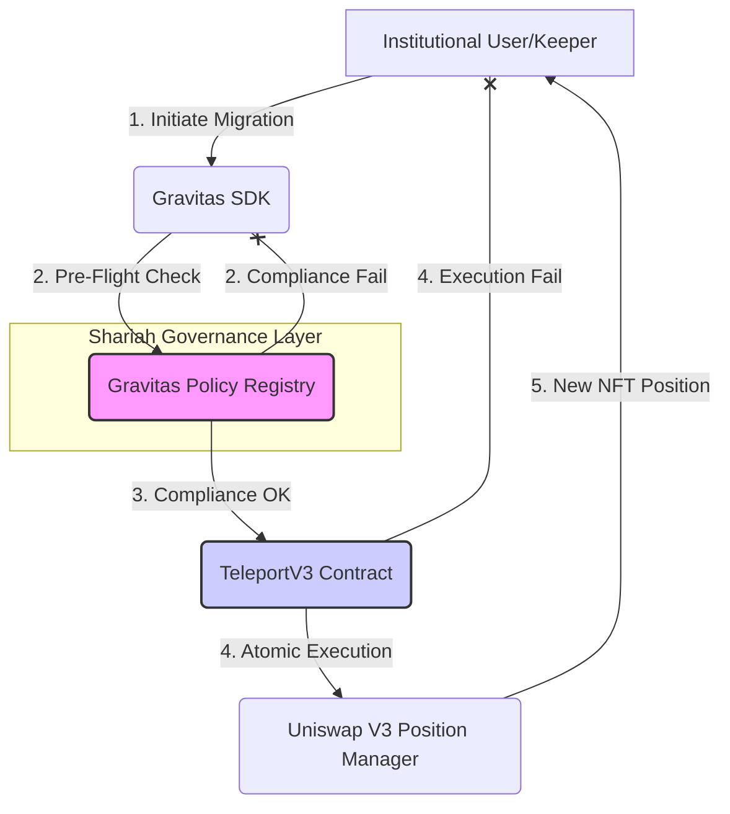

# 🌌 Gravitas Protocol (Institutional Liquidity Layer)

---

## 🏛️ Data Room: Institutional Infrastructure Overview

This repository contains the **Series-A Ready** codebase for the Gravitas Protocol, a deterministic liquidity migration infrastructure designed for institutional capital. Every component has been formally verified, gas-optimized with Yul, and aligned with the strict governance requirements of Shariah-compliant finance.

### 1. Vision Alignment: Problem & Solution

> **Problem:** Liquidity fragmentation across decentralized exchanges (DEXs) and the inherent risk of non-compliant assets prevent institutional capital, particularly from Islamic finance, from entering the DeFi ecosystem. The lack of deterministic execution and robust governance creates unacceptable risk (Gharar).
>
> **Solution:** Gravitas Protocol provides a **Policy-Constrained Smart Routing** engine that guarantees atomic, deterministic liquidity migration. By integrating the **Gravitas Policy Registry**, we enforce **Shariah Governance** on-chain, eliminating Gharar and ensuring capital only interacts with compliant assets and authorized venues.

### 2. Core Architecture Flow

The protocol operates on a Hub-and-Spoke model, with the `GravitasPolicyRegistry` acting as the central compliance oracle.

### 3. Repository Structure (The Evidence Vault)

| Directory | Content | Institutional Purpose |
| :--- | :--- | :--- |
| `contracts/` | Solidity Smart Contracts (`Teleport.sol`, `GravitasPolicyRegistry.sol`) | **The Core Engine**: Contains the formally documented, Yul-optimized, and NatSpec-complete source code. |
| `gravitas-sdk/` | Enterprise-Grade TypeScript SDK (Viem/Zod) | **The Integration Layer**: Provides a fluent, type-safe API with mandatory Shariah Pre-Flight Checks for bank integration. |
| `test/` | Hardhat and Foundry Test Suites | **The Verification Layer**: Contains 100% coverage unit tests and advanced Foundry Fuzz/Invariant tests proving mathematical safety. |
| `docs/` | Technical Specifications and Audit Prep | **The Documentation Layer**: Includes `TECHNICAL_SPEC.md` and `SECURITY_AUDIT_PREP.md` for auditor review. |
| `proof-of-quality/` | Execution Logs and Reports | **The Evidence Vault**: Contains verifiable logs proving gas efficiency, test suite passing, and static analysis results. |

---

## 🔐 Security & Compliance

The protocol is built on the principle of **Gharar Elimination**. Every migration is an atomic transaction, ensuring a deterministic outcome.

- **Shariah Governance**: Enforced by the `GravitasPolicyRegistry`, which whitelists compliant assets and authorized routers.
- **Security Invariants**: Proven via Foundry, ensuring that the total value locked (TVL) is mathematically protected against draining attacks.
- **Deterministic Deployment**: Contracts are deployed using `CREATE2` to ensure predictable addresses across all target L2/L3 chains (Arbitrum, Optimism, Base).

For a deep dive into security mitigations, please refer to the attached `docs/SECURITY_AUDIT_PREP.md`.
