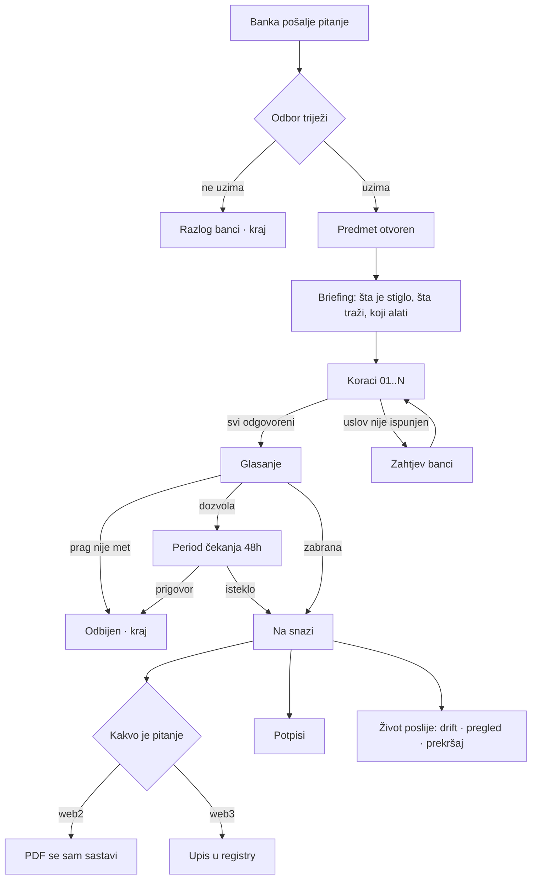
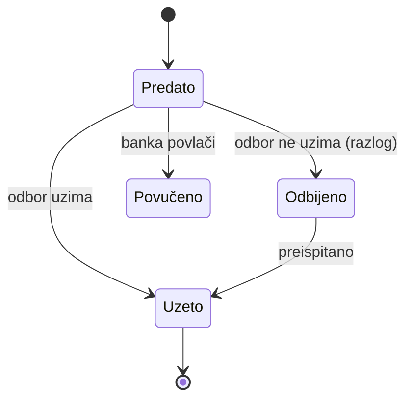
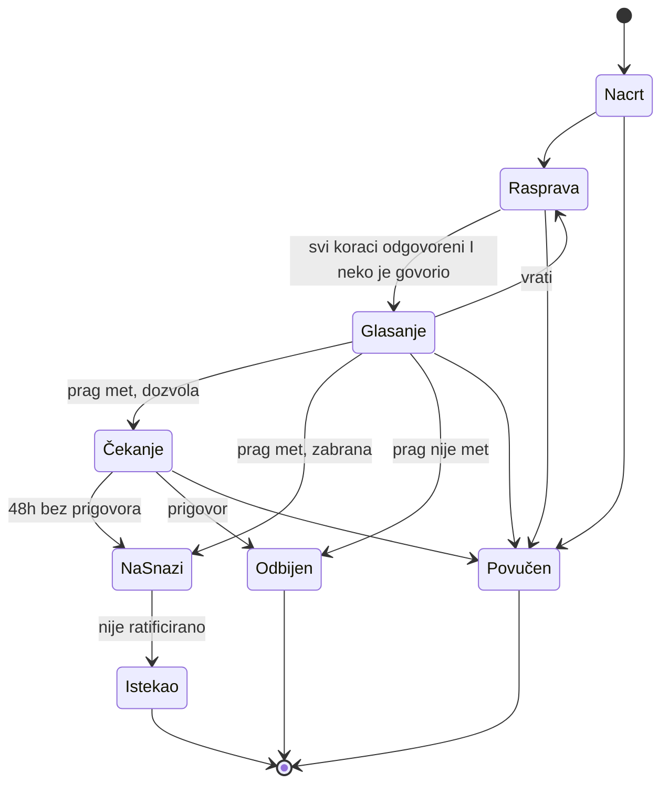
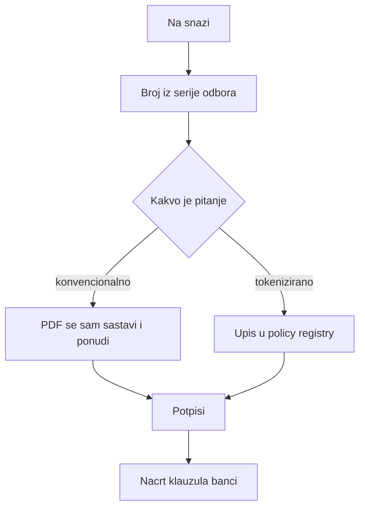
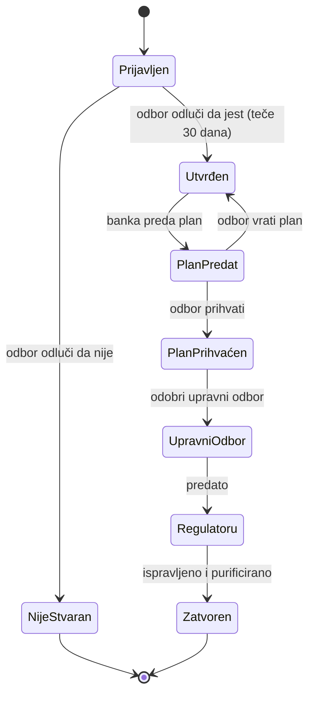
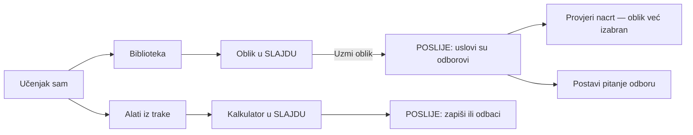
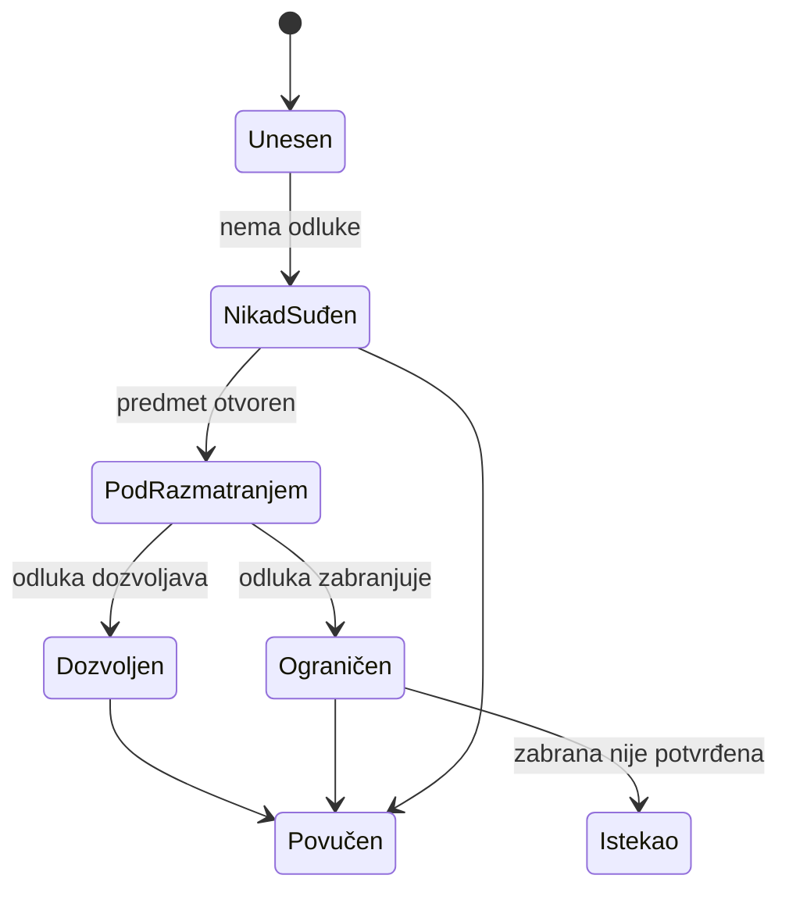
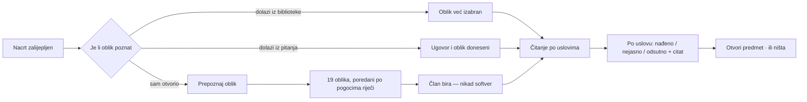
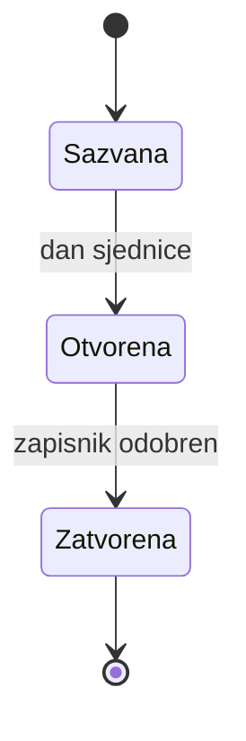

# Algoritam Majlisa

Ovo je specifikacija toka, ne popis gumbi. Svaki čvor ima **ime, ekran,
uslove, činove, i gdje svaki čin vodi**. Uz svaki čvor piše i **kako izgleda
kroz aplikaciju** — koji prozor, koja okna, koja traka, koji alat.

Sve granice su čitane iz koda: prelazi iz `services/lifecycle.ts`, uloge iz
`lib/identity.ts`, faze prekršaja i vrste računa iz `server/src/types.ts`.

---

## 0 · Kako se ovo čita

**Čvor** `N-xx` je jedno stanje aplikacije: tačno jedan prozor na ekranu.

Svaki čvor ima:

```
N-xx  IME
      PROZOR     koji okvir, koja okna, šta je u traci
      ULAZ       odakle se dolazi
      ALAT       šta aplikacija sama otvori tu
      ČIN        [gumb]  uslov  →  odredište
      IZLAZ      gdje se završava
```

**Tipovi prozora** — samo četiri, i svaki čvor koristi jedan:

| tip | kad | anatomija |
|---|---|---|
| **RADNI** | korak u toku | naslovna traka · traka stanica · rad · bočno okno · traka činova |
| **DIJALOG** | čin sa posljedicom | naslov · šta radi i kome · polje razloga · otkaži / uradi |
| **SLAJD** | izbor ili alat | naslov · sadržaj koji se skroluje · traka činova |
| **POSLIJE** | ishod čina | šta je urađeno · šta to znači · **šta slijedi** (≤3) |

Nijedan čvor nije „stranica sa klikanjem". Ako neki jeste, to je greška u
ovom dokumentu ili u kodu.

---

## 1 · Cijeli sistem



---

## 2 · Tok 1 — pitanje stiže



### N-10 · BANKA POSTAVLJA PITANJE

```
PROZOR   RADNI — jedna stanica, bez trake
ULAZ     /ask  ·  uloga: banka ili bilo ko od odbora
ALAT     nijedan
ČIN      [Izaberi fajl]     uvijek              →  ostaje, fajl priložen
         [Postavi odboru]   naslov i pitanje popunjeni  →  N-11
                            inače: gumb mrtav
IZLAZ    POSLIJE: „predato, čeka odbor" → moja pitanja · šta me obavezuje
```

### N-11 · U REDU KOD ODBORA

```
PROZOR   RADNI — red, najstarije prvo
ULAZ     /  ili  /questions
ALAT     prepoznavanje oblika iz priloženog ugovora — automatski
ČIN      [Uzmi kao predmet]  uloga raspravlja  →  DIJALOG: naslov, prijedlog,
                              smjer (dozvola/zabrana)  →  N-20
         [Ne uzimaj]         uloga raspravlja  →  DIJALOG: razlog obavezan
                                                  →  POSLIJE: banka vidi razlog
         [Više o ovom]       uvijek            →  sklopljeno: pozadina, ugovor
         posmatrač/banka     —                 →  činova nema
IZLAZ    N-20 ili kraj
```

**NEMA:** notifikacija čim pitanje stigne.

---

## 3 · Tok 2 — predmet, stanje po stanje



### N-20 · BRIEFING — stanica `i`

```
PROZOR   RADNI · traka:  [i] 01 02 .. N [V]
         rad: šta su poslali · šta traže · po čemu se sudi · KOJI ALATI
         okno: pitanje, šta se ne odlučuje, oblik
ULAZ     N-11, ili povratak na stanicu i
ALAT     nijedan još — ovdje se samo **najavljuju** oni koje oblik traži
         (iz structure.calculations, ne iz teksta uslova)
ČIN      [Pročitao sam — kreni]  →  N-30 prvog koraka bez odgovora
                                    ako ih nema  →  N-40
IZLAZ    N-30
```

**KLJUČ:** sažetak „traže ovo i ovo" iz PDF-a traži model.

### N-30 · KORAK — jedan uslov

```
PROZOR   RADNI · traka stanica, tekuća označena
         rad: zahtjev · zašto postoji · ALAT · šta su drugi našli · razlog
         okno: pitanje (stoji cijelim putem)
         traka: [Ne primjenjuje se] [Nije ispunjen] [Ispunjen — dalje]
ULAZ     N-20, ili prethodni korak, ili klik na stanicu u traci
ALAT     ako uslov traži brojku → kalkulator koji OBLIK imenuje, otvoren
         u koraku, popunjen iz dokumenta (KLJUČ), vezan za ovaj uslov
         ako uslov traži dokument → čitač dokumenta, sa stranicom i citatom
ČIN      [Ispunjen — dalje]   razlog upisan    →  zapis  →  sljedeći bez
                                                  odgovora, inače N-40
                              razlog prazan    →  mrtav, traka kaže zašto
         [Nije ispunjen]      razlog upisan    →  DIJALOG (šta to znači:
                                                  klauzula banci sa linijom
                                                  da ugovor mora predvidjeti)
                                                  →  zapis  →  N-31
         [Ne primjenjuje se]  razlog upisan    →  DIJALOG (ne pravi klauzulu)
                                                  →  zapis  →  sljedeći
         [Pitaj banku]        nije već pitano  →  DIJALOG sa uslovom u sebi
                                                  →  N-32
         uloga ne raspravlja  —                →  činova nema
IZLAZ    sljedeći korak · N-31 · N-32 · N-40
```

### N-31 · POSLIJE „NIJE ISPUNJEN"

```
PROZOR   POSLIJE, u radnom prozoru
         „zapisano kao neispunjeno · ide na odluku I u klauzule banci"
ČIN      [Postavi banci zahtjev]  →  N-32
         [Sljedeći korak]         →  N-30
         [Ništa više]             →  ostaje
```

### N-32 · ZAHTJEV BANCI

```
PROZOR   DIJALOG → POSLIJE
ALAT     nacrt se otvara sa tekstom uslova već u sebi
ČIN      [Pošalji]  tekst upisan  →  na ekran banke /i-owe
                                     sat predmeta se ODVAJA (ne skriva)
IZLAZ    POSLIJE: „banka ima pitanje, sat se odvaja" → nazad na korak
```

### N-40 · GLASANJE — stanica `V`

```
PROZOR   RADNI · rad: prag, ko je kako glasao, ko nije
ULAZ     zadnji korak, ili klik na V
ALAT     nijedan
ČIN      [Otvori glasanje]   koraci odgovoreni I neko govorio, potpisnik
                             →  DIJALOG: prag N, ko mora potpisati  →  glasanje
                             koraci nisu  →  GUMBA NEMA, piše koliko fali
                             niko nije govorio  →  ??? NEDEFINISANO
         [Zapiši glas]       potpisnik, nije glasao  →  DIJALOG: za/protiv/
                             suzdržan + razlog  →  koliko još fali
                             već glasao  →  ??? NEDEFINISANO
         [Zatvori glasanje]  potpisnik  →  DIJALOG: prag met/nije, šta slijedi
                             u oba slučaja  →  N-50 · N-41 · odbijen
         [Prigovori]         čekanje, potpisnik  →  DIJALOG: pisani razlog
                             →  zaustavljeno
         savjetodavni/vezni  →  činova nema, može u raspravi
IZLAZ    N-41 · N-50 · kraj
```

### N-41 · PERIOD ČEKANJA (samo dozvola)

```
PROZOR   RADNI · rad: koliko je ostalo, ko može zaustaviti
ČIN      [Prigovori]  potpisnik  →  DIJALOG  →  odbijen
         sat istekne             →  N-50 automatski
IZLAZ    N-50 ili kraj
```

---

## 4 · Tok 3 — odluka izlazi



### N-50 · ODLUKA NA SNAZI

```
PROZOR   RADNI, bez trake stanica
         rad: pisana odluka, potpisi, broj SSB/godina/n
ALAT     nijedan
AUTOMATSKI  broj iz serije            IMA
            PDF sam iskoči            NEMA
            upis u registry (web3)    NEMA — ugovor onlyOwner
            PDF banci                 BANKA
ČIN      [Potpiši uređajem]   ima upisan uređaj  →  DIJALOG: šta potpis
                              dokazuje a šta ne  →  POSLIJE
                              nema uređaja       →  potpis prijavom
         [Reci banci]         →  DIJALOG  →  BANKA
IZLAZ    kraj toka predmeta
```

---

## 5 · Tok 4 — prekršaj, osam faza



| čvor | čin | ko | grana |
|---|---|---|---|
| Prijavljen | Prijavi | **danas samo odbor** | odluka čeka |
| | Slažem se / **Ne slažem se** | potpisnik, razlog obavezan **u oba smjera** | Utvrđen · **NijeStvaran — nema na ekranu** |
| Utvrđen | Zaustavljeno · Na upravni | sekretar/vezni | datum u zapis |
| PlanPredat | Prihvati · **Vrati sa razlogom** | odbor | naprijed · nazad |
| | Purifikacija | odbor | iznos i kome |
| | Plaćeno | **danas samo odbor, banka ne može** | odluka čeka |
| Zatvoren | Zatvori | odbor | u godišnji izvještaj |

---

## 6 · Tok 5 — bez pitanja iz banke



### N-60 · ALATI

```
PROZOR   SLAJD · sedam kartica
ULAZ     [Alati] u gornjoj traci — sa BILO KOJEG ekrana
ALAT     screening · purifikacija · zekat · raspodjela · tangibilnost ·
         zatezna · zapisani računi
ČIN      [Izračunaj]     →  rezultat i da li prelazi prag
         [Zapiši]        →  POSLIJE: „zapisano, nije vezano ni za koji predmet"
IZLAZ    zatvori — vraća tačno gdje si bio
```

**Razlika koja se mora razumjeti:** u koraku alat bira **aplikacija** (iz
oblika) i rezultat se **veže za uslov**. Iz trake bira **član** i rezultat se
**ne veže ni za šta** dok ga ne zapiše.

---

## 7 · Ko šta smije — matrica

| čin | potpisnik | savjetodavni | vezni | sekretar | banka | posmatrač |
|---|---|---|---|---|---|---|
| raspravlja, zapisuje nalaz | ✓ | ✓ | ✓ | ✓ | — | — |
| glasa, zatvara, prigovara | ✓ | — | — | — | — | — |
| potpisuje odluku | ✓ | — | — | — | — | — |
| unosi šta je banka uradila | — | — | ✓ | ✓ | — | — |
| zapisnik sjednice | — | — | — | ✓ *(i predsjedavajući)* | — | — |
| kvorum, serija brojeva | — | — | — | ✓ *(i predsjedavajući)* | — | — |
| predaje pitanje | ✓ | ✓ | ✓ | ✓ | ✓ | — |
| troja vrata banke | — | — | — | — | ✓ | — |

---

## 8 · Stanja koja nisu činovi

| situacija | šta prozor radi |
|---|---|
| server ćuti | *ne zna se* ≠ *ništa ne čeka* |
| prazno | rečenica šta to znači |
| bez asistenta | paneli **odsutni**, ne sivi; briefing kaže da brojke neće doći popunjene |
| bez lanca | tokenizirano **ne postoji** kao pojam |
| bez volumena | prilaganje odsutno |
| timelock istekne | **NEMA — nije rečeno šta se desi** |
| stara adresa | **NEMA preusmjerenja** |

---

## 9 · Otvoreno — traži odluku, ne kod

| | |
|---|---|
| **Izuzeće člana** | nema rute nigdje |
| **Ratifikacija zabrane** | prozor u tipu, čina nema → zabrana nikad ne istekne |
| **Ko prijavljuje prekršaj i plaća purifikaciju** | danas samo odbor |
| **Nalaz dok je glasanje otvoreno** | nije zabranjeno u kodu |
| **Promjena glasa** | nedefinisano |
| **Glasanje bez rasprave** | server odbija, ekran ne kaže unaprijed |
| **Kvorum i serija brojeva** | rute nema — kod se štiti od promjene koja ne postoji (vidi N-161) |

---

## 10 · Šta ostaje da se napravi

1. Prozor + „šta slijedi" na svih 74 čina — danas ~8
2. Sedam odluka iz §9
3. Automatizam §4 — PDF i registry
4. Notifikacija, timelock kad istekne, stare adrese
5. KLJUČ — sažetak i brojke iz PDF-a
6. BANKA — slanje

---

---

# 11 · Kako se ovo ponaša kao aplikacija

Do ovdje je pisalo **šta** se dešava. Ovaj dio piše **kako** — i to je razlika
između aplikacije i stranice na koju se klika. Stranica se učita, pročita i
napusti. Aplikacija je **sesija rada**: pamti gdje si, ne gubi ono što si
otkucao, odgovara na tastaturu, i nikad te ne baci na početak.

Svako pravilo ispod je obavezno na svakom čvoru. Ako neki čvor to ne radi, to
je greška, a ne stvar ukusa.

## 11.1 · Nikad se ne gubi mjesto

| pravilo | zašto |
|---|---|
| Zatvaranje slajda ili dijaloga vraća **tačno** gdje si bio — ista pozicija skrola, isto otvoreno okno | Ako te vrati na vrh liste od 19 ugovora, to je stranica |
| Čin koji uspije **ne prebacuje** te na drugi ekran sam od sebe | Prebacivanje odlučuje umjesto tebe; „šta slijedi" ti daje izbor |
| Povratak na predmet otvara **stanicu na kojoj si stao**, ne prvi korak | Predmet od šest koraka se radi u više sjedanja |
| Osvježavanje stranice (F5) vraća isti čvor | Adresa nosi stanje: `/matters/x?step=03` |
| Naprijed/nazad u browseru rade kroz stanice | Stanica je stanje, ne stranica |

**NEMA danas:** stanica nije u adresi; F5 vraća na prvi neodgovoreni korak.

## 11.2 · Otkucano se ne gubi

| pravilo |
|---|
| Razlog otkucan u koraku **preživi** otvaranje kalkulatora, bočnog okna, i prelazak na drugu stanicu i nazad |
| Zatvaranje dijaloga sa otkucanim tekstom **pita** prije nego ga baci |
| Odbijanje sa servera **ne prazni** polja — ni jedno |
| Nacrt pitanja banci se čuva kao nacrt dok se ne pošalje |

**NEMA danas:** prelazak na drugu stanicu briše otkucani razlog.

## 11.3 · Tastatura

| tipka | gdje | šta radi |
|---|---|---|
| `Esc` | dijalog, slajd | zatvara — **radi** |
| `Tab` | svuda | kroz kontrole redom kako se čitaju |
| `Enter` | polje jednog reda | glavni čin tog prozora |
| `Ctrl+Enter` | polje više redova | glavni čin — jer `Enter` tu pravi novi red |
| `←` `→` | traka stanica | prethodna / sljedeća stanica |
| `?` | svuda | šta tipke rade ovdje |
| `/` | svuda | pretraga |

**NEMA danas:** sve osim `Esc`.

## 11.4 · Čekanje

| pravilo | zašto |
|---|---|
| Ekran koji je već tu **ostaje** dok se osvježava | Prazan ekran sa vrtuljkom je korak unazad |
| Sporo se javlja **na mjestu gdje je** — u traci činova, ne preko cijelog ekrana | Cijeli ekran blokiran zbog jednog polja je stranica |
| Gumb koji radi piše da radi i **ne može se pritisnuti dvaput** | Dva ista nalaza iz dva klika su greška u zapisu |
| Ako traje duže od dvije sekunde, kaže **šta** čeka | „Učitavanje" ne govori ništa |

**IMA:** ekran ostaje (`useStillThere`). **NEMA:** ostalo.

## 11.5 · Greške

| pravilo |
|---|
| Greška se pojavi **uz kontrolu** koja ju je izazvala, ne na vrhu ekrana |
| Tekst kaže **šta uraditi**, ne šifru |
| Ekran ostaje upotrebljiv — ostali činovi rade |
| Server koji ćuti ≠ *nema ničega*. To su dvije različite rečenice |
| Greška koja se ponovi tri puta nudi **šta dalje** (osvježi, javi vezni) |

**IMA:** prve četiri. **NEMA:** zadnja.

## 11.6 · Prozori se slažu, ne zamjenjuju

```
RADNI prozor
  └── SLAJD (alat, ugovor)        ← radni ostaje iza, vidljiv
        └── DIJALOG (čin)          ← slajd ostaje iza
```

| pravilo |
|---|
| `Esc` zatvara **samo najgornji** |
| Ono ispod **ostaje živo** i vidi se |
| Nikad tri nivoa — ako treba, čvor je pogrešno zamišljen |
| Fokus ulazi u novi prozor i **vraća se** na gumb koji ga je otvorio |

**IMA:** fokus i Esc. **NEMA:** pravilo o tri nivoa nije nigdje provjereno.

## 11.7 · Brojevi koji žive

| gdje | šta |
|---|---|
| Traka: `Šta te treba` | broj se mijenja čim se nešto riješi, bez osvježavanja |
| Traka stanica | stanica postane zelena čim se nalaz zapiše |
| Glasanje | `2 od 3` se mijenja čim neko glasa |
| Statusna traka | šta instalacija ima — uvijek tačno |

**NEMA danas:** sve se mijenja tek na sljedeće učitavanje.

## 11.8 · Ništa se ne briše

| čin | šta se stvarno desi |
|---|---|
| „Povuci" bilo šta | ostaje u zapisu, označeno povučenim, sa razlogom i imenom |
| Ispravka nalaza | novi nalaz **zamjenjuje** stari; stari se vidi u historiji |
| Jedini pravi brisač | **uređaj za potpis** — to je ključ, ne zapis. Potpisi ostaju |

**IMA.** Ovo je već tako i mora ostati.

## 11.9 · Aplikacija predlaže, čovjek odlučuje

| aplikacija smije | aplikacija ne smije |
|---|---|
| otvoriti alat koji oblik imenuje | izabrati alat iz teksta uslova |
| popuniti brojku iz dokumenta, sa citatom | upisati je u račun bez potvrde |
| ponuditi raniji nalaz odbora o istom uslovu | zapisati ga kao tvoj |
| reći da prag nije met | zaključiti da je nešto dozvoljeno |
| složiti PDF čim odluka stupi na snagu | poslati ga bez čovjeka |

**Ovo je granica cijelog proizvoda.** Sve iznad je automatizam koji skida
posao; sve ispod je softver koji presuđuje umjesto odbora.

## 11.10 · Šta se vidi bez ijednog klika

Na svakom čvoru, bez otvaranja ičega:

1. **gdje si** — naslov i traka stanica
2. **šta se traži od tebe sada** — jedna rečenica
3. **šta možeš uraditi** — traka činova, uvijek na istom mjestu
4. **šta je stanje** — čipovi, brojevi, statusna traka

Ako nešto od ova četiri traži klik, čvor je pogrešno složen.

---

# 12 · Registar — šta banka drži



**Stanje se ne čuva, nego izvodi** iz odluka na snazi i otvorenih predmeta.
Zapisano stanje je druga kopija istine: pravilo se povuče a značka ostane
zelena.

### N-70 · REGISTAR, LISTA

```
PROZOR   RADNI · red po redu, grupisano po stanju
ULAZ     traka → Registar
ALAT     nijedan
ČIN      [red]                 →  N-71
         [Unesi holding]       uloga raspravlja  →  DIJALOG (N-72)
         posmatrač             →  samo čitanje
IZLAZ    N-71 · N-72
```

### N-71 · JEDAN HOLDING

```
PROZOR   RADNI · rad: identifikatori, sastav, drift, odluke koje ga imenuju
         okno: stanje, ko ga je unio, kad
ULAZ     N-70, ili sa predmeta koji ga imenuje
ALAT     drift se računa sam — sastav protiv termina odluke
ČIN      [Otvori predmet o ovome]  drift postoji  →  DIJALOG: šta se pomjerilo
                                    →  novi predmet, holding već imenovan
         [Označi kako se drži]      raspravlja, lanac prikačen  →  N-73
                                    nema lanca  →  GUMBA NEMA, pojma nema
         [Povuci iz registra]       raspravlja  →  DIJALOG: razlog, ostaje u
                                    zapisu  →  POSLIJE
         [Papir o holdingu]         uvijek  →  PDF sve što je odbor ikad
                                    odlučio o njemu
IZLAZ    predmet · N-73 · POSLIJE
```

### N-72 · UNOS HOLDINGA

```
PROZOR   DIJALOG
ČIN      [Unesi]  ime i bar jedan identifikator  →  POSLIJE:
         „u registru je, **nije odobren** — niko o njemu nije odlučio"
         →  otvori predmet o njemu · nazad na registar
```

**Ovo razlikovanje je cijela poenta:** *niko nije pitao* ≠ *nije dozvoljeno*.

### N-73 · KONVENCIONALNO ILI TOKENIZIRANO

```
PROZOR   DIJALOG
         „ovo mijenja ko izvršava svaku odluku o ovom holdingu"
ČIN      [Konvencionalno]  →  ljudi u banci izvršavaju, provjera na pregledu
         [Tokenizirano]    →  ugovor odbija transakciju koja krši
IZLAZ    POSLIJE: koje odluke ovo mijenja, poimence
```

**Ako oznake nema:** čita se iz adrese ugovora i **piše da se čita**, ne da je
odbor rekao.

### N-74 · SPAJANJE INSTRUMENATA

```
ČIN      [Ovo je isti instrument kao...]  →  NEMA RUTE
```

**NEMA.** Dva zapisa o istom instrumentu danas ostaju dva.

---

# 13 · Provjera nacrta — bez otvaranja predmeta



### N-80 · ČITAČ NACRTA

```
PROZOR   RADNI · dva okna: tekst nacrta lijevo, uslovi desno
ULAZ     /check  ·  ?shape=<id> oblik već izabran
                 ·  ?from=<pitanje> i ugovor donesen
                 ·  bez toga: prvo N-81
ALAT     čitač: po uslovu vraća **nađeno / nejasno / odsutno**, sa rečenicom
         i mjestom gdje počinje — **nikad presudu**
ČIN      [Pročitaj]        tekst i oblik postoje  →  nalazi po uslovu
         [Otvori predmet]  bilo kad  →  predmet sa nacrtom i oblikom u sebi
         uloga ne raspravlja  →  činova nema
IZLAZ    N-30 (kao korak predmeta) ili kraj
```

### N-81 · KOJI JE OVO OBLIK

```
PROZOR   SLAJD
ALAT     prepoznavanje: čita nacrt protiv svih 19, broji pogotke riječi
ČIN      [oblik]  →  izabran, natrag u N-80
IZLAZ    N-80
```

**Piše doslovno:** *ovo je brojanje riječi, ne čitanje ugovora. Oblik na vrhu
je onaj gdje ih ima najviše, ne onaj koji ovo jest. Biraš sam.*

---

# 14 · Dokazi na predmetu

### N-90 · DOKAZI

```
PROZOR   SLAJD iz koraka, ili dio radnog prozora
ČIN      [Priloži izvor]      raspravlja  →  DIJALOG: vrsta, naslov, gdje
         [Priloži dokument]   raspravlja I ima volumen  →  fajl
                              nema volumena  →  GUMBA NEMA, piše zašto
         [Pročitaj brojke]    ima asistenta  →  N-91
                              nema  →  GUMBA NEMA
         [Prigovori izvoru]   raspravlja  →  DIJALOG: zašto ne stoji
         [Povuci izvor]       onaj ko ga je priložio  →  DIJALOG: ostaje
                              u zapisu, označen
         [Pročitaj protiv uslova]  ima dokument  →  čitač u koraku
IZLAZ    korak
```

### N-91 · BROJKE IZ DOKUMENTA

```
PROZOR   DIJALOG → kalkulator
ALAT     izvlačenje: po polju vraća vrijednost, **rečenicu iz koje je uzeta**,
         stranicu, i da li je citat provjeren u tekstu
ČIN      [Potvrdi ovu brojku]  →  ulazi u kalkulator
         [Nije to]             →  odbačeno, zapisano da je odbačeno
IZLAZ    kalkulator, popunjen samo potvrđenim
```

**Ništa ne ulazi u račun bez čovjeka.** To je pravilo §11.9.

---

# 15 · Sjednice



### N-100 · SJEDNICE

```
ČIN      [Sazovi sjednicu]  predsjedavajući/sekretar  →  DIJALOG: datum,
                            dnevni red iz otvorenih predmeta  →  N-101
IZLAZ    N-101
```

### N-101 · JEDNA SJEDNICA

```
PROZOR   RADNI · rad: dnevni red, tačka po tačka
         okno: ko je pozvan, ko je potvrdio
ČIN      [Prisustvo]    sekretar/predsjedavajući, otvorena  →  ko je bio
         [Zapisnik]     isti, otvorena  →  šta je rečeno i odlučeno
         [Zatvori]      isti, zapisnik upisan  →  DIJALOG: **poslije ovoga
                        se ne mijenja**  →  POSLIJE
         zatvorena      →  sve mrtvo, samo čitanje
IZLAZ    knjiga sjednice (PDF)
```

### N-102 · KNJIGA SJEDNICE

```
ALAT     sastavlja se sama: za svaku tačku cijeli paket predmeta
ČIN      [Otvori knjigu]  →  PDF, štampa se
```

---

# 16 · Obaveze

### N-110 · OBAVEZE

```
PROZOR   RADNI · grupisano: dospjelo · ovaj mjesec · kasnije
ČIN      [Zapiši obavezu]  raspravlja  →  DIJALOG: ko, šta, do kad
         [Reci šta je bilo]  onaj ko duguje ili sekretar  →  DIJALOG
                             →  POSLIJE: zatvoreno
         dospjelo            →  crveni red u „Šta te treba"
IZLAZ    POSLIJE
```

---

# 17 · Pregledi izvršenja

### N-120 · PREGLEDI

```
PROZOR   RADNI
ČIN      [Zapiši pregled]  sekretar ili vezni — **ne potpisnik**  →  N-121
```

**Zašto ne potpisnik:** pregled je funkcija same institucije koja izvještava
odbor. Potpisnik koji bi ga zapisao bi izvještavao samom sebi.

### N-121 · ZAPISIVANJE PREGLEDA

```
PROZOR   RADNI · korak po korak, kao predmet
         01 period  ·  02 kako je uzorak biran  ·  03 koliko transakcija
         04 nalaz po uslovu  ·  05 nalaz po terminu  ·  06 izuzeci
ALAT     nijedan — Majlis **ne bira uzorak**
ČIN      [Dalje]     polje popunjeno  →  sljedeći
         [Zapiši]    sve popunjeno  →  POSLIJE: ide u godišnji izvještaj
         broj transakcija nepoznat  →  pokrivenost se piše **nepoznata**,
                                       nikad procijenjena
IZLAZ    POSLIJE
```

---

# 18 · Komiteti

### N-130 · KOMITETI

```
ČIN      [Osnuj komitet]     predsjedavajući  →  DIJALOG: ime, ko sjedi,
                             šta radi  →  POSLIJE
         [Raspusti]          predsjedavajući  →  DIJALOG: razlog; upućivanja
                             u toku **ostaju u zapisu**
```

### N-131 · UPUĆIVANJE

```
ULAZ     sa predmeta: [Pošalji komitetu]
ČIN      [Uputi]     raspravlja  →  DIJALOG: šta se traži od komiteta
                     →  POSLIJE: predmet čeka, **glasanje nije blokirano**
         [Izvještaj] član komiteta  →  DIJALOG: šta su našli
                     →  vidi se na predmetu, kao nalaz komiteta
         [Povuci]    onaj ko je uputio  →  DIJALOG: razlog
```

**Komitet ne presuđuje.** Njegov nalaz je građa, ne odluka.

---

# 19 · Biblioteka i oblici

### N-140 · BIBLIOTEKA

```
PROZOR   RADNI · 19 oblika, grupisano: uzeti · izmijenjeni · odbijeni · netaknuti
ČIN      [oblik]              →  N-141 u SLAJDU
         [Provjeri nacrt]     →  N-80 sa oblikom već izabranim
```

### N-141 · JEDAN OBLIK

```
PROZOR   SLAJD
         rad: uslovi jedan po jedan, zašto svaki postoji
         okno: šta se dešava dalje, činjenice, provjeri nacrt
ČIN      [Uzmi ovaj oblik]    raspravlja I postoji odluka na snazi
                              →  DIJALOG: uslovi postaju odborovi  →  POSLIJE
                              nema odluke  →  GUMBA NEMA: „usvajanje traži
                              odluku, ne dugme"
         [Preispitaj]         već uzet  →  isti dijalog, zamjenjuje raniji
         [Odbij ovaj oblik]   raspravlja  →  DIJALOG: razlog; ostaje u
                              biblioteci sa razlogom
         [Izmijeni uslov]     raspravlja  →  uslovi odbora ≠ isporučeni
IZLAZ    POSLIJE: iz predmeta → nazad na predmet
                  samostalno → provjeri nacrt · postavi pitanje
```

**Ništa ne postaje obavezujuće administracijom.** Uzimanje oblika traži odluku
na snazi iza sebe.

---

# 20 · Bilješke na tekstu

### N-150 · BILJEŠKA

```
ULAZ     označiš riječi u pitanju ili prijedlogu
PROZOR   DIJALOG uz označeni tekst
ČIN      [Zapiši bilješku]  raspravlja  →  veže se za **tačno te riječi**
         [Povuci bilješku]  autor  →  ostaje, označena povučenom
IZLAZ    bilješka uz tekst, vidi je cijeli odbor
```

---

# 21 · Nalog i odbor

### N-160 · TVOJ NALOG

```
PROZOR   SLAJD iz imena u traci
ČIN      [Ime i titula]    ti  →  DIJALOG: **mijenja se odsad; izdane
                           odluke zadržavaju ime pod kojim su potpisane**
         [Lozinka]         ti, znaš trenutnu  →  DIJALOG
         [Upiši uređaj]    ti, siguran kontekst  →  otisak/lice/PIN
                           nije siguran kontekst  →  GUMBA NEMA, piše koja
                           je od tri stvari u putu
         [Zaboravi uređaj] ti  →  DIJALOG: **potpisi ostaju**
```

### N-161 · ODBOR

```
PROZOR   SLAJD
ČIN      [Kvorum, prozor, serija]  **RUTE NEMA** — pisaću rutu za odbor
                                   nema uopšte. Kvorum se vidi, ne mijenja.
         [Izdaj kod za povratak]   predsjedavajući/sekretar  →  DIJALOG:
                                   tvoje ime ide u zapis
         [Unovči kod]              —  →  ZID: stranica je iza brave
         [Članovi]                 —  →  **NIKAD**: aplikacija koja uređuje
                                   svoj odbor odlučuje ko sjedi u njemu
```

**Provjereno u kodu, ne po sjećanju.** Nijedna od 74 rute ne piše u odbor.
Zato `openVoting` **zamrzava prag na predmet** u trenutku otvaranja glasanja —
komentar u `governance.ts:1148` to i kaže: *„odbor smije promijeniti svoj
kvorum, a glasanje suđeno po broju kakav zatekne pri zatvaranju moglo bi se
iznijeti spuštanjem praga usred glasanja."* Zaštita postoji za čin koji još ne
postoji.

**Odluka za vlasnika:** ili se piše prozor za kvorum (pa zamrzavanje konačno
ima smisla), ili se piše da se kvorum postavlja pri instalaciji i tu ostaje.
Treće nema — danas je kvorum broj koji niko ne može promijeniti kroz
aplikaciju, a kod se ponaša kao da može.

---

# 22 · Papiri i pretraga

### N-170 · PAPIRI

| papir | odakle | šta je |
|---|---|---|
| Odluka | predmet na snazi | pitanje, termini, razlozi, potpisi, broj serije |
| Klauzule | predmet na snazi | šta ugovor mora sadržavati |
| Priručnik | Papiri | svako pravilo na snazi, uslovi, kako se izvršava |
| Godišnji | Papiri | godina odbora + **šta zapis ne može reći** |
| Holding | holding | sve o jednom instrumentu |
| Izvoz | Papiri | cijeli zapis sa otiskom, jednim činom |
| Kalendar | Dolazi | svaki datum, u tvoj kalendar |

**Svi se sastavljaju iz zapisa u trenutku traženja** — ne mogu se razići s njim.

### N-171 · PRETRAGA

```
PROZOR   RADNI · upit gore, rezultati po vrsti
ČIN      [rezultat]  →  otvara taj zapis na svom čvoru
```

---

# 23 · Asistent

### N-180 · ASISTENT

```
ULAZ     traka → Pitaj (samo ako je konfigurisan)
ČIN      [Pitaj]  →  objašnjava mehanizam, **odbija presuditi** na tri jezika
nema ključa  →  ekrana nema uopšte, statusna traka kaže zašto
```

---

# 24 · Potpis odluke

### N-190 · POTPIS

```
PROZOR   RADNI (odluka na snazi) · rad: pisana odluka, ko je potpisao
ČIN      [Potpiši uređajem]   ima upisan uređaj  →  DIJALOG: **šta potpis
                              dokazuje** (držao uređaj i otključao ga)
                              **i šta ne** (ko je ta osoba)  →  potpis
         [Potpiši prijavom]   uvijek  →  slabiji dokaz, piše na odluci
         nacrt se pomjerio    →  raniji potpis stoji uz napomenu da je
                                 potpisan drugi tekst
IZLAZ    POSLIJE: koliko potpisa ima, koliko treba
```

---

# 25 · Predmet — preostali činovi

| čin | ko | kad | dijalog kaže |
|---|---|---|---|
| Promijeni oblik | raspravlja | prije glasanja | koraci se mijenjaju, **nalazi ostaju** |
| Postavi termine | raspravlja | prije glasanja | **ovo je ono što ide u registry** |
| Šta mora poslije | raspravlja | uvijek | koraci za banku poslije odluke |
| Odgovor banke | vezni/sekretar | pitanje poslano | ulazi kao odgovor institucije |
| Vrati u raspravu | potpisnik | glasanje | **glasovi padaju** |
| Povuci predmet | raspravlja | sve osim na snazi | ništa ne slijedi iz njega |
| Reci nešto | raspravlja | do zatvaranja | ulazi u raspravu |

---

# 26 · Provjera pokrivenosti — svaki čin na svoj čvor

Ovo nije pisano po sjećanju. Brojano je ovom naredbom, u `server/src`:

```bash
grep -rhA1 "router\.\(post\|put\|patch\|delete\)(" routes/ | grep -o "'/[^']*'" | tr -d "'" | sort
```

**74 čina.** Ne 76 — ranija brojka u ovim dokumentima bila je pogrešna.

## Predmet — 24

| ruta | čin u aplikaciji | čvor |
|---|---|---|
| `POST /matters` | Postavi pitanje odboru | N-11 |
| `/matters/:id/open` | Otvori raspravu | N-20 |
| `/matters/:id/structure` | Promijeni oblik | §25 |
| `/matters/:id/parameters` | Postavi termine | §25 |
| `/matters/:id/findings` | Zapiši nalaz po uslovu | N-30 · N-31 · N-32 |
| `/matters/:id/reading` | Pročitaj nacrt protiv uslova | N-30 |
| `/matters/:id/deliberation` | Reci nešto | §25 |
| `/matters/:id/asked` | Pitaj banku | N-30 |
| `/matters/:id/asked/:q/answer` | Odgovor banke | §25 |
| `/matters/:id/sources` | Priloži izvor | N-90 |
| `/matters/:id/sources/file` | Priloži dokument | N-90 |
| `/matters/:id/sources/:s` | Povuci izvor | N-90 |
| `/matters/:id/sources/:s/against` | Prigovori izvoru | N-90 |
| `/matters/:id/sources/:s/extract` | Pročitaj brojke iz dokumenta | N-91 |
| `/matters/:id/object` | Prigovori prijedlogu | N-40 |
| `/matters/:id/voting` | Otvori glasanje | N-40 |
| `/matters/:id/vote` | Glasaj | N-40 |
| `/matters/:id/close` | Zatvori glasanje | N-41 |
| `/matters/:id/reopen` | Vrati u raspravu | §25 |
| `/matters/:id/force` | Stupa na snagu | N-41 |
| `/matters/:id/withdraw` | Povuci predmet | §25 |
| `/matters/:id/implementation` | Šta banka mora poslije | §25 |
| `/matters/:id/sign/request` | Traži potpis uređajem | N-190 |
| `/matters/:id/sign` | Potpiši odluku | N-190 |

## Prekršaji — 11

| ruta | čin | faza |
|---|---|---|
| `POST /incidents` | Prijavi prekršaj | 1 |
| `/incidents/:id/concurrence` | Je li stvarno prekršaj | 2 |
| `/incidents/:id/stopped` | Zaustavljeno | 3 |
| `/incidents/:id/purification` | Koliko se očisti | 4 |
| `/incidents/:id/purification/paid` | Plaćeno | 5 |
| `/incidents/:id/plan` | Plan sanacije | 6 |
| `/incidents/:id/plan/endorse` | Odobri plan | 7 |
| `/incidents/:id/plan/return` | Vrati plan | 7 |
| `/incidents/:id/directors` | Upravi na znanje | 8 |
| `/incidents/:id/submission` | Regulatoru | 8 |
| `/incidents/:id/close` | Zatvori | 8 |

Svi u §5. **Osam faza, jedanaest činova** — plan ima dva ishoda, čišćenje dva
koraka.

## Pitanja banke — 4

| ruta | čin | čvor |
|---|---|---|
| `POST /submissions` | Banka predaje pitanje | N-10 |
| `/submissions/:id/open` | Otvori predmet iz pitanja | N-11 |
| `/submissions/:id/decline` | Vrati pitanje banci | N-11 |
| `/submissions/:id/withdraw` | Banka povlači pitanje | N-10 |

## Registar — 3

| ruta | čin | čvor |
|---|---|---|
| `POST /assets` | Unesi holding | N-72 |
| `/assets/:id/held-as` | Konvencionalno ili tokenizirano | N-73 |
| `/assets/:id/retire` | Povuci iz registra | N-71 |

## Sjednice — 4

| ruta | čin | čvor |
|---|---|---|
| `POST /meetings` | Sazovi sjednicu | N-100 |
| `/meetings/:id/attendance` | Prisustvo | N-101 |
| `/meetings/:id/minute` | Zapisnik | N-101 |
| `/meetings/:id/close` | Zatvori sjednicu | N-101 |

## Komiteti i upućivanja — 5

| ruta | čin | čvor |
|---|---|---|
| `POST /committees` | Osnuj komitet | N-130 |
| `/committees/:id/dissolve` | Raspusti komitet | N-130 |
| `POST /referrals` | Uputi komitetu | N-131 |
| `/referrals/:id/report` | Izvještaj komiteta | N-131 |
| `/referrals/:id/withdraw` | Povuci upućivanje | N-131 |

## Uređaji za potpis — 3

| ruta | čin | čvor |
|---|---|---|
| `/devices/request` | Počni upis uređaja | N-160 |
| `POST /devices` | Upiši uređaj | N-160 |
| `DELETE /devices/:id` | Zaboravi uređaj | N-160 |

## Nalog i povratak pristupa — 4

| ruta | čin | čvor |
|---|---|---|
| `/me/details` | Ime i titula | N-160 |
| `/me/password` | Lozinka | N-160 |
| `/members/password/reset` | Izdaj kod za povratak | N-161 |
| `/members/reset` | Unovči kod | **ZID** — stranice nema |

## Alati — 6 računa + 2 zapisa

| ruta | čin | čvor |
|---|---|---|
| `POST /screening` | Screening | N-30 u koraku · N-70 iz trake |
| `POST /purification` | Purifikacija | isto |
| `POST /zakat` | Zekat | isto |
| `POST /distribution` | Raspodjela dobiti | isto |
| `POST /tradability` | Tangibilnost | isto |
| `POST /late-payment` | Zatezna | isto |
| `POST /computations` | Zapiši račun | N-70 |
| `/computations/:id/withdraw` | Povuci zapisani račun | N-70 |

## Čitanje nacrta — 2

| ruta | čin | čvor |
|---|---|---|
| `POST /reading` | Pročitaj nacrt protiv uslova | N-80 |
| `POST /recognise` | Koji je ovo oblik | N-81 |

## Ostalo — 6

| ruta | čin | čvor |
|---|---|---|
| `POST /adoptions` | Uzmi oblik iz biblioteke | N-141 |
| `POST /annotations` | Zapiši bilješku | N-150 |
| `/annotations/:id/withdraw` | Povuci bilješku | N-150 |
| `POST /undertakings` | Zapiši obavezu | N-110 |
| `/undertakings/:id/close` | Reci šta je bilo | N-110 |
| `POST /examinations` | Zapiši pregled | N-121 |

## Zbir

| područje | činova |
|---|---|
| Predmet | 24 |
| Prekršaji | 11 |
| Alati i zapisi | 8 |
| Ostalo (biblioteka, bilješke, obaveze, pregledi) | 6 |
| Pitanja banke | 4 |
| Sjednice | 4 |
| Nalog i povratak | 4 |
| Komiteti i upućivanja | 5 |
| Registar | 3 |
| Uređaji | 3 |
| Čitanje nacrta | 2 |
| **ukupno** | **74** |

**Svaki čin ima čvor.** Dva imaju zid umjesto ekrana i to piše. Jedan čvor
(N-161, kvorum) opisuje čin **kojeg u kodu nema** — i to piše.

---
# 27 · Šta ostaje, po redu

1. **§11 ponašanje** — stanica u adresi, otkucano preživi, tastatura, brojevi
   koji žive. Ovo se osjeti na svakom ekranu odjednom.
2. **Prozor + „šta slijedi"** na svim činovima koji ga nemaju
3. **Sedam odluka iz §9** — traže vlasnika, ne kod
4. **Automatizam §4** — PDF sam, registry
5. **Notifikacija · timelock kad istekne · stare adrese**
6. **Spajanje instrumenata** (N-74) — nema rute
7. **KLJUČ** — sažetak i brojke · **BANKA** — slanje
