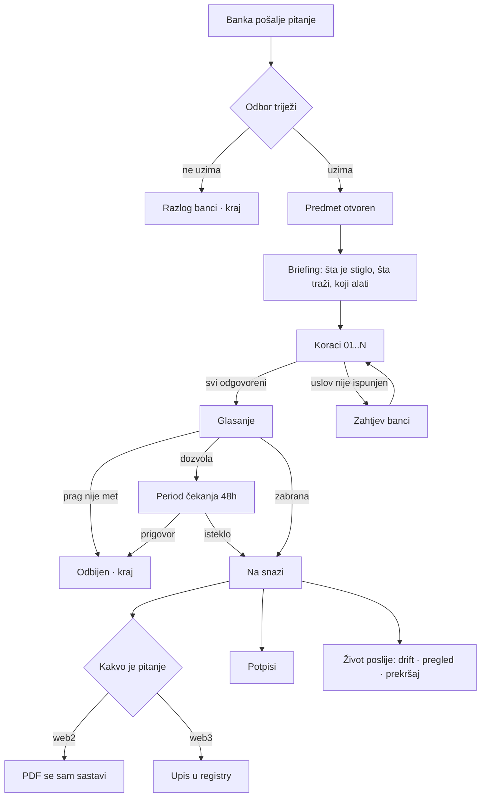
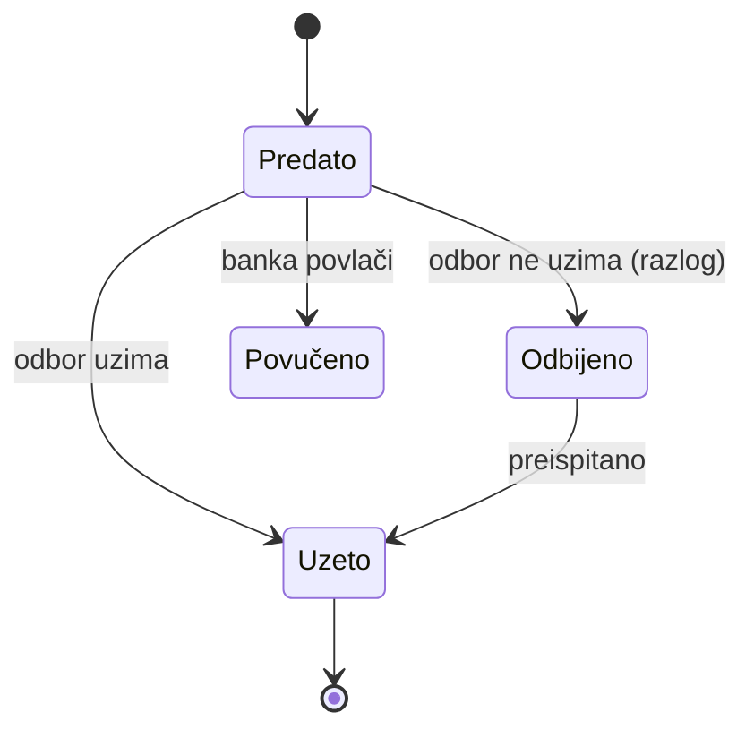
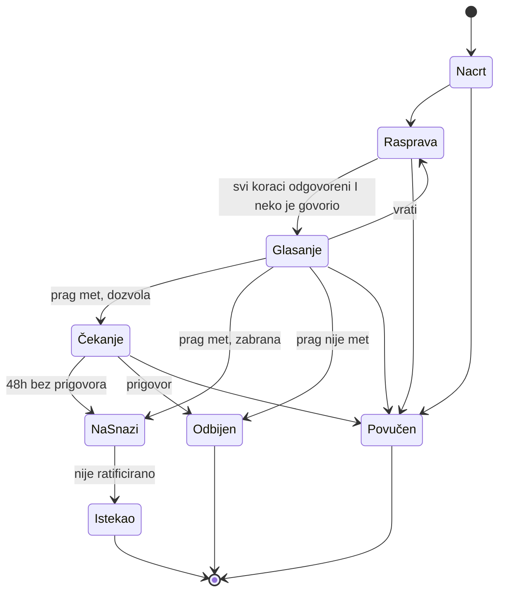
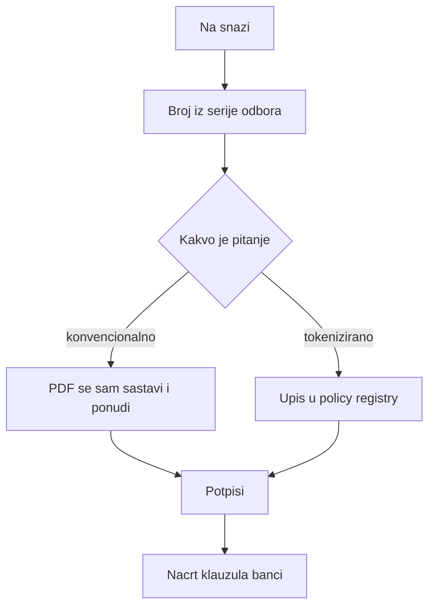
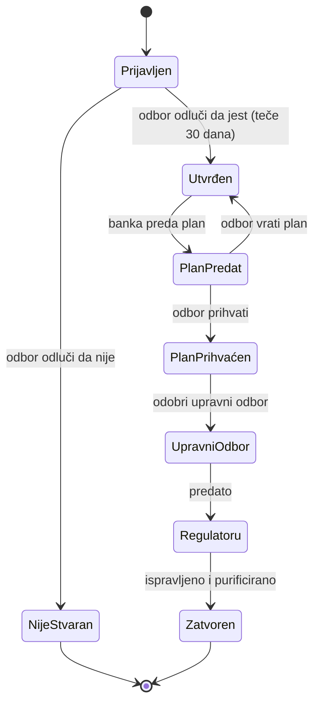
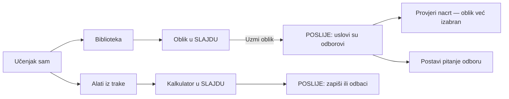
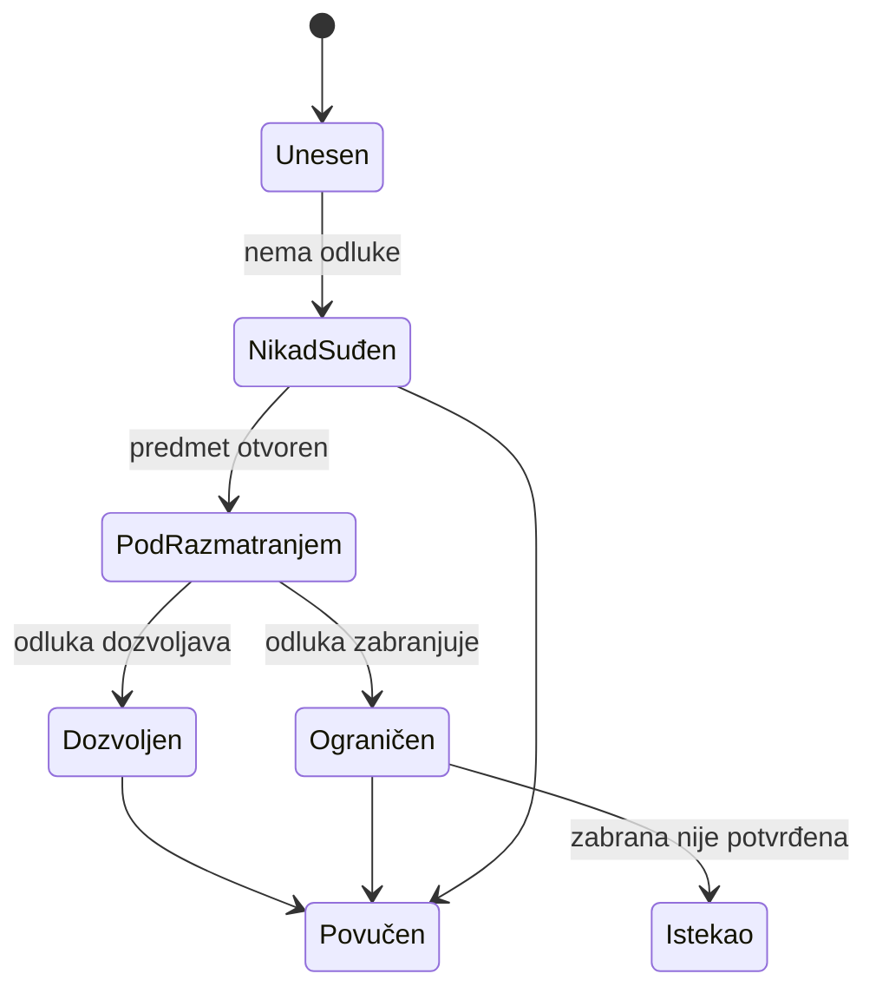
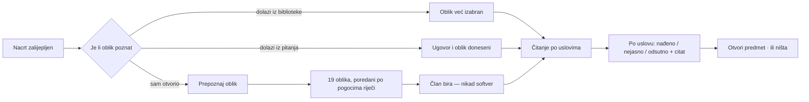
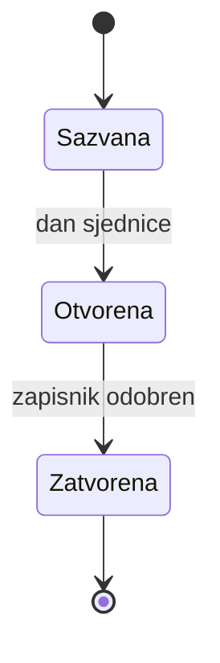

# Algoritam Majlisa

Ovo je specifikacija toka, ne popis gumbi. Čita se u tri sloja:

| sloj | šta je | gdje |
|---|---|---|
| **Algoritam** | petlje, uslovi, grananja — šta se vrti i dok se šta ne desi | §A–§J |
| **Čvorovi** | 50 ekrana: prozor, ulaz, alat, činovi, izlaz | §1–§25 · §28–§33 |
| **Ljuska** | deset zakona koji se **mjere**, i test od šest pitanja po čvoru | **§35** |
| **Provjera** | svih 74 čina, svaki na svoj čvor, brojano iz koda | §26–§27 · §34 |

**Ako čitaš samo jedno:** §35. Algoritam govori šta se dešava; §35 je razlog
zašto to neće ispasti web stranica, i jedini dio koji se može oboriti
mjerenjem umjesto raspravom.

Svaki čvor ima **ime, ekran, uslove, činove, i gdje svaki čin vodi**. Uz svaki
čvor piše i **kako izgleda kroz aplikaciju** — koji prozor, koja okna, koja
traka, koji alat.

Sve granice su čitane iz koda: prelazi iz `services/lifecycle.ts`, uloge iz
`lib/identity.ts`, faze prekršaja i vrste računa iz `server/src/types.ts`.

---

## 0 · Kako se ovo čita

**Čvor** `N-xx` je jedno stanje aplikacije: tačno jedan prozor na ekranu.

Svaki čvor ima:

```
N-xx  IME
      PROZOR     koji okvir, koja okna, šta je u traci
      ULAZ       odakle se dolazi
      ALAT       šta aplikacija sama otvori tu
      ČIN        [gumb]  uslov  →  odredište
      IZLAZ      gdje se završava
```

**Tipovi prozora** — samo četiri, i svaki čvor koristi jedan:

| tip | kad | anatomija |
|---|---|---|
| **RADNI** | korak u toku | naslovna traka · traka stanica · rad · bočno okno · traka činova |
| **DIJALOG** | čin sa posljedicom | naslov · šta radi i kome · polje razloga · otkaži / uradi |
| **SLAJD** | izbor ili alat | naslov · sadržaj koji se skroluje · traka činova |
| **POSLIJE** | ishod čina | šta je urađeno · šta to znači · **šta slijedi** (≤3) |

Nijedan čvor nije „stranica sa klikanjem". Ako neki jeste, to je greška u
ovom dokumentu ili u kodu.

---

# A · Šta je ovaj dokument bio, a šta mu je falilo

Do §12 ovdje je bio **katalog čvorova**: koji ekran postoji i šta je na njemu.
To nije algoritam. Algoritam su **petlje, uslovi i grananja** — šta se vrti,
dok se šta ne desi, i šta tačno uradi svaki pritisak u svakom stanju.

Ovaj sloj (§A–§J) je to. Redoslijed je namjeran:

| | | |
|---|---|---|
| **§B** | Petlje | šta se vrti, u pseudokodu |
| **§C** | Predmet je *slučaj*, ne cjevovod | zašto je raniji model bio pogrešan |
| **§D** | Tablica odluke: koji alat | kako sistem sam zna koji toolkit |
| **§E** | Matrica gumba | svaki gumb × svako stanje × svaka uloga |
| **§F** | Pet stanja svakog ekrana | prazno, učitava, djelimično, greška, idealno |
| **§G** | Brojke iz PDF-a | prag pouzdanosti, citat, potvrdi-ili-ispravi |
| **§H** | Dva para očiju | ko sprema, ko potvrđuje |
| **§I** | Dupli klik, dva člana odjednom | šta se desi i šta danas nema |
| **§J** | Tastatura i obavijesti | kako se ovo vozi bez miša |

---

# B · Petlje — šta se stvarno vrti

## B.1 · Glavna petlja: od pitanja do fatwe

```
PETLJA ODBORA (vrti se dok postoji posao)

  za svako PITANJE u redu:

     # ── TRIJEŽENJE ──────────────────────────────────
     prikaži: šta su poslali, šta traže, prepoznati oblik
     ako odbor NE uzima:
        traži razlog; pošalji banci; sljedeće pitanje
     inače:
        PREDMET ← otvori(pitanje)
        OBLIK   ← član potvrdi prepoznati oblik (aplikacija predlaže)

     # ── PRIPREMA ────────────────────────────────────
     ALATI ← tablica_odluke(OBLIK)          # §D — bez AI
     POLJA ← izvuci_iz_pdf(PITANJE.prilog)  # §G — sa AI, sa citatima
     prikaži briefing: šta traže · po čemu se sudi · koji alati dolaze

     # ── PETLJA KORAKA ───────────────────────────────
     dok postoji uslov bez nalaza:
        U ← prvi uslov bez nalaza
        otvori RADNI PROZOR na U
        ako U traži brojku:
           otvori kalkulator koji OBLIK imenuje
           popuni iz POLJA, svako polje sa citatom
           čekaj da čovjek potvrdi svako polje         # §G
        ako U traži dokument:
           otvori čitač; označi rečenicu koja odgovara
        čekaj čin:
           [Ispunjen]        → traži razlog → zapiši → dalje
           [Nije ispunjen]   → traži razlog → zapiši
                             → klauzula u ugovor banci
                             → ponudi: pitaj banku / dalje
           [Ne primjenjuje]  → traži razlog → zapiši (bez klauzule)
           [Pitaj banku]     → pošalji zahtjev; U ostaje bez nalaza;
                               sat predmeta se ODVAJA; idi na sljedeći U
           [Nazad]           → prethodni U, nalaz ostaje
     # izlaz iz petlje: svaki uslov ima nalaz ILI je pitanje kod banke

     # ── PETLJA ČEKANJA NA BANKU ─────────────────────
     dok ima otvorenih zahtjeva prema banci:
        predmet stoji u „Čeka banku"
        kad odgovor stigne → vrati se u PETLJU KORAKA na taj U

     # ── GLASANJE ────────────────────────────────────
     ako niko nije govorio:
        gumb za glasanje je MRTAV, i piše zašto        # danas ne piše
     zamrzni PRAG ← odbor.kvorum                       # §I.4
     dok je glasanje otvoreno:
        svaki potpisnik: za / protiv / suzdržan + razlog
        prikaz „X od N" se mijenja UŽIVO
        ako predsjedavajući [Zatvori]:
           ako glasova_za < PRAG → ODBIJEN, kraj
           inače ako smjer == dozvola → ČEKANJE (48h)
           inače                      → NA SNAZI

     # ── PETLJA ČEKANJA (samo dozvola) ───────────────
     dok nije isteklo 48h:
        ako neki potpisnik [Prigovori] sa razlogom → ODBIJEN, kraj
     → NA SNAZI

     # ── IZDAVANJE, automatski ───────────────────────
     čim stanje postane NA SNAZI:
        sastavi ODLUKU (PDF) iz zapisa
        sastavi KLAUZULE iz svih „nije ispunjen"
        dodijeli BROJ iz serije odbora
        ako je pitanje web3 I holding je tokeniziran:
           upiši termine u policy registry
        obavijesti banku
        otvori potpisivanje

     # ── ŽIVOT POSLIJE ───────────────────────────────
     predmet prelazi u nadzor: drift · pregled · prekršaj
```

## B.2 · Petlja nadzora (vrti se stalno, u pozadini)

```
za svaku ODLUKU NA SNAZI:
   za svaki HOLDING koji imenuje:
      ako sastav(holding) ≠ termini(odluka):
         DRIFT → crveni red u „Šta te treba"
         ponudi: otvori predmet o pomjeranju

   ako odluka ima rok ratifikacije I rok je prošao:
      → ISTEKLA
```

**Rupa koju ovo otkriva:** zabrana ima prozor ratifikacije u tipu, ali **čina
za ratifikaciju nema** — pa zabrana nikad ne istekne. §9.

## B.3 · Petlja prekršaja

```
PRIJAVLJEN
   → je li stvarno prekršaj?  ne → NIJE STVARAN, kraj
                              da ↓
   → zaustavljeno je?
   → koliko se očisti          (kalkulator purifikacije)
   → plaćeno
   → plan sanacije
   → petlja odobravanja plana:
        dok plan nije odobren:
           odbor [Odobri] → dalje
           odbor [Vrati]  → institucija popravlja → ponovo
   → upravi na znanje
   → ako prag traži: regulatoru
   → ZATVOREN
```

**Jedanaest činova, osam faza** — plan ima dva ishoda, čišćenje dva koraka.

## B.4 · Petlja provjere nacrta (bez predmeta)

```
dok član čita nacrt:
   ako oblik nije izabran:
      prepoznaj → ponudi 19 poredanih → ČOVJEK bira
   za svaki uslov oblika:
      traži u tekstu → NAĐENO (sa rečenicom) / NEJASNO / ODSUTNO
   nikad ne izriči presudu
   ponudi: [Otvori predmet o ovome] → ulazi u GLAVNU PETLJU sa
           nacrtom i oblikom već u sebi
```

---

# C · Predmet nije cjevovod — predmet je *slučaj*

Ovo je glavna ispravka ranijeg modela.

Postoje dvije vrste toka. **Cjevovod** (BPMN) je kad se zna unaprijed šta ide
za čim: prijava kredita, plaćanje. **Slučaj** (CMMN) je kad radi stručnjak
koji sam odlučuje šta mu treba i kojim redom — i tu se ne propisuje *kako*,
nego *šta je dozvoljeno i pod kojim uslovom*.

Rad šerijatskog odbora je slučaj, ne cjevovod. Zato je raniji model — niz
koraka i traka — bio pola istine: **koraci jesu cjevovod, ali predmet nije.**

Iz CMMN-a se uzimaju četiri pojma, i oni rješavaju ono što je falilo:

| pojam | u Majlisu |
|---|---|
| **Faza** (stage) | Nacrt · Rasprava · Glasanje · Čekanje · Na snazi |
| **Ulazni uslov** (sentry) | šta mora biti tačno da faza uopšte počne |
| **Obavezni zadatak** | bez njega faza ne može završiti |
| **Diskrecioni zadatak** | dostupan cijelo vrijeme, član ga uzima ako mu treba |
| **Prekretnica** (milestone) | tačka koja se dostigne, ne posao koji se radi |

## C.1 · Faze predmeta, sa uslovima

| faza | ulazni uslov | obavezno | diskreciono (uvijek dostupno) | prekretnica |
|---|---|---|---|---|
| **Nacrt** | predmet otvoren | naslov, prijedlog, smjer | promijeni oblik · povuci | — |
| **Rasprava** | oblik izabran | nalaz na svakom uslovu · bar jedna riječ rasprave | priloži izvor · pitaj banku · uputi komitetu · bilješka · alat sa strane · promijeni oblik | svi uslovi odgovoreni |
| **Glasanje** | svi uslovi odgovoreni **I** neko je govorio | glasovi do praga | prigovori · vrati u raspravu | prag dostignut |
| **Čekanje** | prag met **I** smjer je dozvola | ništa — vrijeme radi | prigovori (obara) | 48h isteklo |
| **Na snazi** | čekanje isteklo, ili prag met kod zabrane | — | potpiši · papiri · označi holding | odluka izdana |

**Ovo je odgovor na „gdje vodi gumb kad predmet nije otvoren".** Diskrecioni
zadaci su dostupni u cijeloj fazi, ne samo na jednom koraku. Alat otvoren iz
koraka veže rezultat za uslov; isti alat otvoren kao diskrecioni zadatak ne
veže ga ni za šta dok ga član ne zapiše.

## C.2 · Pravilo koje iz ovoga slijedi

> **Obavezni zadatak ide u traku stanica. Diskrecioni ide u bočno okno ili
> komandnu paletu. Nikad obrnuto.**

Zato su alati skinuti sa glavne stranice: nisu odredište, nego diskrecioni
zadatak koji se otvara tamo gdje se radi.

---

# D · Koji alat — tablica odluke

Sistem zna koji toolkit ponuditi **bez ikakvog AI**. Oblik ugovora nosi popis
(`structure.calculations`), i to je tablica odluke sa politikom **Collect**:
pogodi može više pravila, svi se skupe, redoslijed je redoslijed u obliku.

| ulaz: oblik nosi | izlaz: alat koji se otvara u koraku | veže se za |
|---|---|---|
| `screening` | Screening — dozvoljena djelatnost i omjeri | uslov koji ga je tražio |
| `purification` | Purifikacija — koliko prihoda se očisti | isto |
| `zakat` | Zekat — osnovica i stopa | isto |
| `profit_distribution` | Raspodjela dobiti | isto |
| `tangibility` | Tangibilnost — udio stvarne imovine | isto |
| `late_payment` | Zatezna — i gdje ide | isto |

**Zašto ovo, a ne „AI pročita uslov i izabere alat":** alat izabran iz teksta
je pretpostavka. Alat izabran iz oblika je ono što je odbor usvojio. Prvo se
ne može odbraniti pred regulatorom, drugo može. Granica iz §11.9.

**Drugi ulaz iste tablice** — prepoznavanje oblika iz priloženog nacrta:

| ulaz | izlaz | politika |
|---|---|---|
| tekst nacrta | 19 oblika poredanih po pogocima riječi | **Priority** — ali bira čovjek |

Ekran piše doslovno: *ovo je brojanje riječi, ne čitanje ugovora.*

---

# E · Matrica gumba — svaki gumb, u svakom stanju

Format je iz statecharta: **događaj [uslov] / radnja**. Kolone su uvijek iste:

| gumb | vidljiv u | uloga | uslov (guard) | radnja | vodi na | ako padne |
|---|---|---|---|---|---|---|

Pravilo za kolonu „uslov": ako uslov nije ispunjen, gumb je **odsutan sa
razlogom**, ne mrtav bez objašnjenja. Izuzetak je uslov koji član može
ispuniti odmah na tom ekranu (npr. razlog nije upisan) — tada je **mrtav, a
traka piše šta fali**, jer bi nestajanje gumba pri kucanju bilo trzanje.

## E.1 · Predmet — 24 čina

| gumb | vidljiv u | uloga | uslov | radnja | vodi na | ako padne |
|---|---|---|---|---|---|---|
| Postavi pitanje odboru | /ask | banka, odbor | naslov + tekst | `POST /matters` | N-20 | polja ostaju, greška uz gumb |
| Otvori raspravu | nacrt | raspravlja | oblik izabran | `/open` | prvi korak | ostaje u nacrtu |
| Promijeni oblik | nacrt, rasprava | raspravlja | glasanje nije otvoreno | `/structure` | isti ekran | — |
| Postavi termine | nacrt, rasprava | raspravlja | glasanje nije otvoreno | `/parameters` | isti ekran | — |
| Ispunjen — dalje | korak | raspravlja | **razlog ≥1 znak** | `/findings` | sljedeći uslov bez nalaza, ili glasanje | razlog ostaje, greška uz traku |
| Nije ispunjen | korak | raspravlja | razlog ≥1 znak | DIJALOG → `/findings` | N-31 | isto |
| Ne primjenjuje se | korak | raspravlja | razlog ≥1 znak | DIJALOG → `/findings` | sljedeći uslov | isto |
| Pročitaj nacrt | korak | raspravlja | nacrt priložen | `/reading` | isti korak, nalazi uz uslove | poruka uz čitač |
| Reci nešto | rasprava | raspravlja | tekst nije prazan | `/deliberation` | isti ekran | tekst ostaje |
| Pitaj banku | korak | raspravlja | nije već pitano za taj uslov | `/asked` | N-32 | — |
| Odgovor banke | predmet | vezni, sekretar | pitanje poslano | `/asked/:q/answer` | korak tog uslova | — |
| Priloži izvor | dokazi | raspravlja | vrsta + naslov | `/sources` | lista izvora | — |
| Priloži dokument | dokazi | raspravlja | **volumen postoji** | `/sources/file` | lista izvora | ako nema volumena: gumba nema, piše zašto |
| Povuci izvor | dokazi | onaj ko je priložio | razlog | `DELETE /sources/:s` | izvor ostaje, označen | — |
| Prigovori izvoru | dokazi | raspravlja | razlog | `/sources/:s/against` | uz izvor | — |
| Pročitaj brojke | dokument | raspravlja | **ključ postoji** | `/sources/:s/extract` | §G — potvrdi po polju | bez ključa: gumba nema |
| Prigovori prijedlogu | rasprava, čekanje | **potpisnik** | pisani razlog | `/object` | u čekanju: obara u ODBIJEN | — |
| Otvori glasanje | rasprava | **potpisnik** | svi uslovi odgovoreni **I** neko govorio | `/voting` | N-40 | ako uslovi fale: gumba nema, piše koliko |
| Glasaj | glasanje | **potpisnik**, nije glasao | pozicija + razlog | `/vote` | brojač uživo | — |
| Zatvori glasanje | glasanje | **potpisnik** | — | DIJALOG: prag met/nije | čekanje · na snazi · odbijen | — |
| Vrati u raspravu | glasanje | **potpisnik** | — | DIJALOG: **glasovi padaju** | rasprava | — |
| Stupa na snagu | čekanje | potpisnik | 48h isteklo, bez prigovora | `/force` | N-41 | — |
| Povuci predmet | sve osim na snazi | raspravlja | razlog | `/withdraw` | POSLIJE | — |
| Šta banka mora poslije | rasprava, na snazi | raspravlja | bar jedan korak | `/implementation` | isti ekran | — |
| Traži potpis uređajem | na snazi | potpisnik | upisan uređaj **I** siguran kontekst | `/sign/request` | N-190 | piše koja od tri stvari fali |
| Potpiši | na snazi | potpisnik | — | `/sign` | POSLIJE: X od N potpisa | — |

**Dva „NEDEFINISANO" iz §9 vide se ovdje kao prazne ćelije:** nalaz dok je
glasanje otvoreno (kod ne brani), i drugi glas istog člana (nema pravila).

## E.2 · Registar — 3 čina

| gumb | vidljiv u | uloga | uslov | radnja | vodi na | ako padne |
|---|---|---|---|---|---|---|
| Unesi holding | registar | raspravlja | ime + bar jedan identifikator | `POST /assets` | POSLIJE: *„u registru je, **nije odobren**"* | — |
| Označi kako se drži | holding | raspravlja | **lanac prikačen** | `/assets/:id/held-as` | DIJALOG: *mijenja ko izvršava svaku odluku* | bez lanca: gumba nema |
| Povuci iz registra | holding | raspravlja | razlog | `/assets/:id/retire` | ostaje u zapisu | — |

## E.3 · Pitanja banke — 4 čina

| gumb | vidljiv u | uloga | uslov | radnja | vodi na | ako padne |
|---|---|---|---|---|---|---|
| Predaj pitanje | /ask | banka, odbor | naslov + tekst | `POST /submissions` | POSLIJE: „čeka odbor" | prilog ostaje |
| Uzmi kao predmet | red | raspravlja | — | `/submissions/:id/open` | N-20 | — |
| Ne uzimaj | red | raspravlja | **razlog obavezan** | `/submissions/:id/decline` | banka vidi razlog | — |
| Povuci pitanje | moja pitanja | banka | nije već uzeto | `/submissions/:id/withdraw` | POSLIJE | — |

## E.4 · Sjednice — 4 čina

| gumb | vidljiv u | uloga | uslov | radnja | vodi na |
|---|---|---|---|---|---|
| Sazovi sjednicu | sjednice | predsjedavajući, sekretar | datum | `POST /meetings` | N-101 |
| Prisustvo | sjednica | isti | **sjednica otvorena** | `/attendance` | isti ekran |
| Zapisnik | sjednica | isti | otvorena | `/minute` | isti ekran |
| Zatvori sjednicu | sjednica | isti | zapisnik upisan | `/close` | DIJALOG: **poslije se ne mijenja** |

Kad je zatvorena: **svi gumbi nestaju**, ekran je čitanje i knjiga sjednice.

## E.5 · Komiteti i upućivanja — 5 činova

| gumb | vidljiv u | uloga | uslov | radnja | napomena |
|---|---|---|---|---|---|
| Osnuj komitet | komiteti | predsjedavajući | ime + članovi | `POST /committees` | — |
| Raspusti | komitet | predsjedavajući | razlog | `/dissolve` | upućivanja u toku **ostaju u zapisu** |
| Uputi komitetu | predmet | raspravlja | šta se traži | `POST /referrals` | **glasanje se ne blokira** |
| Izvještaj | upućivanje | član komiteta | tekst | `/report` | nalaz je **građa, ne odluka** |
| Povuci upućivanje | upućivanje | onaj ko je uputio | razlog | `/withdraw` | — |

## E.6 · Alati — 8 činova

| gumb | vidljiv u | uloga | uslov | radnja | veže se |
|---|---|---|---|---|---|
| Izračunaj | korak | raspravlja | polja popunjena | jedan od 6 računa | **za uslov** |
| Izračunaj | paleta / bočno okno | raspravlja | polja popunjena | isti račun | **ni za šta** |
| Zapiši račun | rezultat | raspravlja | — | `POST /computations` | POSLIJE: *„zapisano, nije vezano ni za koji predmet"* |
| Povuci račun | zapisani | autor | razlog | `/computations/:id/withdraw` | ostaje, označen |

## E.7 · Ostalo — 9 činova

| gumb | uloga | uslov | radnja | napomena |
|---|---|---|---|---|
| Uzmi oblik | raspravlja | **postoji odluka na snazi** | `POST /adoptions` | bez odluke: gumba nema — *„usvajanje traži odluku, ne dugme"* |
| Zapiši bilješku | raspravlja | označen tekst | `POST /annotations` | veže se za **tačno te riječi** |
| Povuci bilješku | autor | — | `/annotations/:id/withdraw` | ostaje, označena |
| Zapiši obavezu | raspravlja | ko + šta + do kad | `POST /undertakings` | dospjelo → crveni red |
| Reci šta je bilo | dužnik, sekretar | tekst | `/undertakings/:id/close` | — |
| Zapiši pregled | **sekretar, vezni** | svih 6 polja | `POST /examinations` | **ne potpisnik** — inače izvještava sam sebi |
| Ime i titula | ti | — | `/me/details` | izdane odluke zadržavaju staro ime |
| Lozinka | ti | znaš trenutnu | `/me/password` | — |
| Izdaj kod za povratak | predsjedavajući, sekretar | — | `/members/password/reset` | tvoje ime ide u zapis |

## E.8 · Prekršaji — 11 činova

| gumb | faza | uloga | uslov |
|---|---|---|---|
| Prijavi prekršaj | 1 | **danas samo odbor** — §9 | opis |
| Je li stvarno prekršaj | 2 | raspravlja | da/ne + razlog |
| Zaustavljeno | 3 | vezni, sekretar | datum |
| Koliko se očisti | 4 | raspravlja | kalkulator purifikacije |
| Plaćeno | 5 | vezni, sekretar | iznos + dokaz |
| Plan sanacije | 6 | vezni, sekretar | tekst plana |
| Odobri plan | 7 | raspravlja | — |
| Vrati plan | 7 | raspravlja | **razlog** → institucija popravlja |
| Upravi na znanje | 8 | sekretar | — |
| Regulatoru | 8 | sekretar | prag |
| Zatvori | 8 | raspravlja | sve prethodno |

---

# F · Pet stanja svakog ekrana

Ekran koji je nacrtan samo u „sve je u redu" stanju izgleda kao stranica čim
nešto nije u redu. Svaki čvor ima **pet** stanja, i sva se moraju nacrtati:

| stanje | pravilo |
|---|---|
| **Prazno** | nikad samo „nema podataka". Kaže *zašto* je prazno i *šta uraditi*. Prazan registar: „Nijedan holding nije unesen. Unesi prvi." |
| **Učitava** | ekran koji je već tu **ostaje**; sporost se javlja na mjestu gdje je. Ako traje >2s, kaže **šta** čeka |
| **Djelimično** | jedan dio stigao, drugi nije — svaki dio nosi svoje stanje. Nalazi se vide iako brojke iz PDF-a još stižu |
| **Greška** | uz kontrolu koja ju je izazvala. Kaže šta uraditi, ne šifru. Ostali činovi i dalje rade |
| **Idealno** | ono što je do sada bilo jedino nacrtano |

**Šesto stanje, koje ova aplikacija ima a većina nema:** *zid* — čin postoji u
kodu, ekran ne postoji. Dva takva: unovčavanje koda za povratak pristupa, i
prijava banke. Piše se kao zid, ne kao greška.

**I sedmo:** *nema pojma* — instalacija nema ključ, lanac, volumen ili relej.
Tada gumba **nema**, a statusna traka piše koje od tih stvari nema. To je
pravilo koje već postoji i mora ostati.

---

# G · Brojke iz PDF-a — potvrdi ili ispravi

Ovo je „podaci već upisani iz PDF-a". Radi ovako, i nikako drukčije:

```
za svako polje kalkulatora:
   V, CITAT, STRANICA, POUZDANOST ← izvuci(dokument, polje)

   ako CITAT nije doslovno nađen u tekstu:
      odbaci — nema polja, nema vrijednosti
   inače ako POUZDANOST ≥ visoko:
      polje je POPUNJENO i OZNAČENO kao predloženo
      uz njega: rečenica iz koje je uzeto + stranica
   inače:
      polje je PRAZNO, ali uz njega stoji prijedlog i citat

   ništa ne ulazi u račun dok čovjek ne pritisne [Potvrdi]
   [Nije to] → polje prazno, i **zapisano je da je prijedlog odbijen**
```

| pravilo | zašto |
|---|---|
| Citat se provjerava doslovno u tekstu | model koji izmisli rečenicu ne smije proći dalje |
| Uz svaku brojku stoji **odakle je** | odbor mora moći pokazati izvor regulatoru |
| Odbijen prijedlog se **zapisuje** | da se vidi da je čovjek gledao, a ne da nije bilo prijedloga |
| Račun se ne pokreće sam | rezultat bi izgledao kao nalaz odbora, a nije |

**Prag je stvar odbora, ne softvera.** Gdje je granica „visoko" postavlja se pri
instalaciji i piše na ekranu.

**KLJUČ** — ovo cijelo traži model. Bez njega: gumba nema, i piše zašto.

---

# H · Dva para očiju

Ovo aplikacija **već ima**, ali nije bilo zapisano kao pravilo:

| ko sprema | ko potvrđuje | gdje |
|---|---|---|
| bilo ko ko raspravlja — nalaz po uslovu | **potpisnici** — glasanjem | predmet |
| sekretar/vezni — šta je institucija uradila | odbor — na pregledu | pregledi |
| institucija — plan sanacije | odbor — [Odobri] / [Vrati] | prekršaji |
| komitet — izvještaj | odbor — kao građa, ne kao odluka | upućivanja |

**Pravilo:** niko ne potvrđuje sam sebe. Zato pregled **ne smije** zapisati
potpisnik, i zato plan sanacije ne odobrava onaj ko ga je podnio.

---

# I · Dupli klik, zastarjela verzija, dva člana odjednom

Ovdje je najveća rupa koju sam našao čitajući kod, i nije UI rupa.

## I.1 · Dupli pritisak

| | |
|---|---|
| **Danas** | ništa ne sprječava dva ista nalaza iz dva klika |
| **Treba** | gumb koji radi piše da radi i ne prima drugi pritisak |
| **Treba na serveru** | ključ zahtjeva (`Idempotency-Key`) — isti ključ, isti odgovor, bez drugog zapisa |

Bez ovog drugog, prvo je samo ukras: spor mrežni odgovor i F5 daju isti dupli
zapis. **Ključa zahtjeva u kodu nema nigdje** — provjereno.

## I.2 · Dva člana u isto vrijeme

| | |
|---|---|
| **Danas** | `updateMatter` uzima funkciju, pa se ne gubi cijeli predmet, ali **nema verzije** |
| **Šta se desi** | dva člana zapišu nalaz na isti uslov; drugi tiho pregazi prvog |
| **Treba** | predmet nosi verziju; čin nosi verziju koju je član vidio; ako se razišlo → **409**, i ekran kaže *„X je u međuvremenu zapisao ovo — pogledaj pa ponovi"* |

Ovo nije sitnica. Odbor od pet ljudi radi isti predmet u isto vrijeme — to je
cijela poenta.

## I.3 · Zastarjeli ekran

Predmet se promijenio dok si gledao. Ekran **ne smije** izgledati isto.
Traka: *„promijenjeno prije 12 sekundi — [Osvježi]"*. Ne automatski, jer bi ti
pobjegao tekst koji kucaš.

## I.4 · Prag zamrznut na predmetu

`openVoting` zamrzava kvorum na predmet pri otvaranju glasanja, da se glasanje
ne bi iznijelo spuštanjem praga usred glasanja. **Ali rute za mijenjanje
kvoruma nema** — zaštita za čin koji ne postoji. §9, sedma odluka.

---

# J · Tastatura, paleta, obavijesti

## J.1 · Komandna paleta

Aplikacija se prepoznaje po tome što se može voziti bez miša.

```
Ctrl+K   →  paleta: kucaj šta hoćeš
            „zekat"     → otvara kalkulator u bočnom oknu
            „sjednica"  → sazovi sjednicu
            „murabaha"  → skoči na oblik u biblioteci
            ime banke   → njena pitanja
```

Paleta je **jedini put do diskrecionih zadataka sa bilo kojeg ekrana** — zato
alati ne moraju stajati u traci.

## J.2 · Tipke

| tipka | gdje | šta |
|---|---|---|
| `Ctrl+K` | svuda | paleta |
| `Esc` | prozor | zatvara **samo najgornji** |
| `Enter` | polje jednog reda | glavni čin prozora |
| `Ctrl+Enter` | polje više redova | glavni čin |
| `←` `→` | traka stanica | prethodna / sljedeća |
| `/` | svuda | pretraga |
| `?` | svuda | šta tipke rade ovdje |

Fokus ulazi u novi prozor i **vraća se na gumb koji ga je otvorio**. Dok je
prozor otvoren, Tab ne izlazi iz njega.

## J.3 · Obavijesti — ko šta vidi i kad

| događaj | ko vidi | gdje |
|---|---|---|
| pitanje stiglo | svi koji raspravljaju | **odmah** — zvono + „Šta te treba" |
| banka odgovorila | ko je pitao | zvono + predmet se vraća u „Radi se" |
| glasanje otvoreno | svi potpisnici | zvono |
| neko glasao | svi na predmetu | brojač **uživo**, bez zvona |
| 48h isteklo | potpisnici | zvono + predmet ide na snagu |
| drift na holdingu | svi koji raspravljaju | crveni red |
| obaveza dospjela | dužnik + sekretar | crveni red |

**Danas:** relej (`notifier`) postoji **samo prema banci**. Zvona unutar
aplikacije nema uopšte — provjereno u kodu. Ovo je prvo što fali da bi
aplikacija bila aplikacija: *dođe pitanje → odmah iskoči obavijest*.

---

## 1 · Cijeli sistem



---

## 2 · Tok 1 — pitanje stiže



### N-10 · BANKA POSTAVLJA PITANJE

```
PROZOR   RADNI — jedna stanica, bez trake
ULAZ     /ask  ·  uloga: banka ili bilo ko od odbora
ALAT     nijedan
ČIN      [Izaberi fajl]     uvijek              →  ostaje, fajl priložen
         [Postavi odboru]   naslov i pitanje popunjeni  →  N-11
                            inače: gumb mrtav
IZLAZ    POSLIJE: „predato, čeka odbor" → moja pitanja · šta me obavezuje
```

### N-11 · U REDU KOD ODBORA

```
PROZOR   RADNI — red, najstarije prvo
ULAZ     /  ili  /questions
ALAT     prepoznavanje oblika iz priloženog ugovora — automatski
ČIN      [Uzmi kao predmet]  uloga raspravlja  →  DIJALOG: naslov, prijedlog,
                              smjer (dozvola/zabrana)  →  N-20
         [Ne uzimaj]         uloga raspravlja  →  DIJALOG: razlog obavezan
                                                  →  POSLIJE: banka vidi razlog
         [Više o ovom]       uvijek            →  sklopljeno: pozadina, ugovor
         posmatrač/banka     —                 →  činova nema
IZLAZ    N-20 ili kraj
```

**NEMA:** notifikacija čim pitanje stigne.

---

## 3 · Tok 2 — predmet, stanje po stanje



### N-20 · BRIEFING — stanica `i`

```
PROZOR   RADNI · traka:  [i] 01 02 .. N [V]
         rad: šta su poslali · šta traže · po čemu se sudi · KOJI ALATI
         okno: pitanje, šta se ne odlučuje, oblik
ULAZ     N-11, ili povratak na stanicu i
ALAT     nijedan još — ovdje se samo **najavljuju** oni koje oblik traži
         (iz structure.calculations, ne iz teksta uslova)
ČIN      [Pročitao sam — kreni]  →  N-30 prvog koraka bez odgovora
                                    ako ih nema  →  N-40
IZLAZ    N-30
```

**KLJUČ:** sažetak „traže ovo i ovo" iz PDF-a traži model.

### N-30 · KORAK — jedan uslov

```
PROZOR   RADNI · traka stanica, tekuća označena
         rad: zahtjev · zašto postoji · ALAT · šta su drugi našli · razlog
         okno: pitanje (stoji cijelim putem)
         traka: [Ne primjenjuje se] [Nije ispunjen] [Ispunjen — dalje]
ULAZ     N-20, ili prethodni korak, ili klik na stanicu u traci
ALAT     ako uslov traži brojku → kalkulator koji OBLIK imenuje, otvoren
         u koraku, popunjen iz dokumenta (KLJUČ), vezan za ovaj uslov
         ako uslov traži dokument → čitač dokumenta, sa stranicom i citatom
ČIN      [Ispunjen — dalje]   razlog upisan    →  zapis  →  sljedeći bez
                                                  odgovora, inače N-40
                              razlog prazan    →  mrtav, traka kaže zašto
         [Nije ispunjen]      razlog upisan    →  DIJALOG (šta to znači:
                                                  klauzula banci sa linijom
                                                  da ugovor mora predvidjeti)
                                                  →  zapis  →  N-31
         [Ne primjenjuje se]  razlog upisan    →  DIJALOG (ne pravi klauzulu)
                                                  →  zapis  →  sljedeći
         [Pitaj banku]        nije već pitano  →  DIJALOG sa uslovom u sebi
                                                  →  N-32
         uloga ne raspravlja  —                →  činova nema
IZLAZ    sljedeći korak · N-31 · N-32 · N-40
```

### N-31 · POSLIJE „NIJE ISPUNJEN"

```
PROZOR   POSLIJE, u radnom prozoru
         „zapisano kao neispunjeno · ide na odluku I u klauzule banci"
ČIN      [Postavi banci zahtjev]  →  N-32
         [Sljedeći korak]         →  N-30
         [Ništa više]             →  ostaje
```

### N-32 · ZAHTJEV BANCI

```
PROZOR   DIJALOG → POSLIJE
ALAT     nacrt se otvara sa tekstom uslova već u sebi
ČIN      [Pošalji]  tekst upisan  →  na ekran banke /i-owe
                                     sat predmeta se ODVAJA (ne skriva)
IZLAZ    POSLIJE: „banka ima pitanje, sat se odvaja" → nazad na korak
```

### N-40 · GLASANJE — stanica `V`

```
PROZOR   RADNI · rad: prag, ko je kako glasao, ko nije
ULAZ     zadnji korak, ili klik na V
ALAT     nijedan
ČIN      [Otvori glasanje]   koraci odgovoreni I neko govorio, potpisnik
                             →  DIJALOG: prag N, ko mora potpisati  →  glasanje
                             koraci nisu  →  GUMBA NEMA, piše koliko fali
                             niko nije govorio  →  ??? NEDEFINISANO
         [Zapiši glas]       potpisnik, nije glasao  →  DIJALOG: za/protiv/
                             suzdržan + razlog  →  koliko još fali
                             već glasao  →  ??? NEDEFINISANO
         [Zatvori glasanje]  potpisnik  →  DIJALOG: prag met/nije, šta slijedi
                             u oba slučaja  →  N-50 · N-41 · odbijen
         [Prigovori]         čekanje, potpisnik  →  DIJALOG: pisani razlog
                             →  zaustavljeno
         savjetodavni/vezni  →  činova nema, može u raspravi
IZLAZ    N-41 · N-50 · kraj
```

### N-41 · PERIOD ČEKANJA (samo dozvola)

```
PROZOR   RADNI · rad: koliko je ostalo, ko može zaustaviti
ČIN      [Prigovori]  potpisnik  →  DIJALOG  →  odbijen
         sat istekne             →  N-50 automatski
IZLAZ    N-50 ili kraj
```

---

## 4 · Tok 3 — odluka izlazi



### N-50 · ODLUKA NA SNAZI

```
PROZOR   RADNI, bez trake stanica
         rad: pisana odluka, potpisi, broj SSB/godina/n
ALAT     nijedan
AUTOMATSKI  broj iz serije            IMA
            PDF sam iskoči            NEMA
            upis u registry (web3)    NEMA — ugovor onlyOwner
            PDF banci                 BANKA
ČIN      [Potpiši uređajem]   ima upisan uređaj  →  DIJALOG: šta potpis
                              dokazuje a šta ne  →  POSLIJE
                              nema uređaja       →  potpis prijavom
         [Reci banci]         →  DIJALOG  →  BANKA
IZLAZ    kraj toka predmeta
```

---

## 5 · Tok 4 — prekršaj, osam faza



| čvor | čin | ko | grana |
|---|---|---|---|
| Prijavljen | Prijavi | **danas samo odbor** | odluka čeka |
| | Slažem se / **Ne slažem se** | potpisnik, razlog obavezan **u oba smjera** | Utvrđen · **NijeStvaran — nema na ekranu** |
| Utvrđen | Zaustavljeno · Na upravni | sekretar/vezni | datum u zapis |
| PlanPredat | Prihvati · **Vrati sa razlogom** | odbor | naprijed · nazad |
| | Purifikacija | odbor | iznos i kome |
| | Plaćeno | **danas samo odbor, banka ne može** | odluka čeka |
| Zatvoren | Zatvori | odbor | u godišnji izvještaj |

---

## 6 · Tok 5 — bez pitanja iz banke



### N-60 · ALATI

```
PROZOR   SLAJD · sedam kartica
ULAZ     [Alati] u gornjoj traci — sa BILO KOJEG ekrana
ALAT     screening · purifikacija · zekat · raspodjela · tangibilnost ·
         zatezna · zapisani računi
ČIN      [Izračunaj]     →  rezultat i da li prelazi prag
         [Zapiši]        →  POSLIJE: „zapisano, nije vezano ni za koji predmet"
IZLAZ    zatvori — vraća tačno gdje si bio
```

**Razlika koja se mora razumjeti:** u koraku alat bira **aplikacija** (iz
oblika) i rezultat se **veže za uslov**. Iz trake bira **član** i rezultat se
**ne veže ni za šta** dok ga ne zapiše.

---

## 7 · Ko šta smije — matrica

| čin | potpisnik | savjetodavni | vezni | sekretar | banka | posmatrač |
|---|---|---|---|---|---|---|
| raspravlja, zapisuje nalaz | ✓ | ✓ | ✓ | ✓ | — | — |
| glasa, zatvara, prigovara | ✓ | — | — | — | — | — |
| potpisuje odluku | ✓ | — | — | — | — | — |
| unosi šta je banka uradila | — | — | ✓ | ✓ | — | — |
| zapisnik sjednice | — | — | — | ✓ *(i predsjedavajući)* | — | — |
| kvorum, serija brojeva | — | — | — | ✓ *(i predsjedavajući)* | — | — |
| predaje pitanje | ✓ | ✓ | ✓ | ✓ | ✓ | — |
| troja vrata banke | — | — | — | — | ✓ | — |

---

## 8 · Stanja koja nisu činovi

| situacija | šta prozor radi |
|---|---|
| server ćuti | *ne zna se* ≠ *ništa ne čeka* |
| prazno | rečenica šta to znači |
| bez asistenta | paneli **odsutni**, ne sivi; briefing kaže da brojke neće doći popunjene |
| bez lanca | tokenizirano **ne postoji** kao pojam |
| bez volumena | prilaganje odsutno |
| timelock istekne | **NEMA — nije rečeno šta se desi** |
| stara adresa | **NEMA preusmjerenja** |

---

## 9 · Otvoreno — traži odluku, ne kod

| | |
|---|---|
| **Izuzeće člana** | nema rute nigdje |
| **Ratifikacija zabrane** | prozor u tipu, čina nema → zabrana nikad ne istekne |
| **Ko prijavljuje prekršaj i plaća purifikaciju** | danas samo odbor |
| **Nalaz dok je glasanje otvoreno** | nije zabranjeno u kodu |
| **Promjena glasa** | nedefinisano |
| **Glasanje bez rasprave** | server odbija, ekran ne kaže unaprijed |
| **Kvorum i serija brojeva** | rute nema — kod se štiti od promjene koja ne postoji (vidi N-161) |

---

## 10 · Šta ostaje da se napravi

**Ovdje je nekad stajala lista. Premještena je u §27**, gdje je poredana po
tome šta najviše mijenja osjećaj da je ovo aplikacija, i gdje ispred svega
stoji stavka 0 iz §35.

Dvije liste istog posla su dva reda gradnje, a drugi se uvijek zaboravi
ažurirati. **Jedan red gradnje postoji i to je §27.**

---

---

# 11 · Kako se ovo ponaša kao aplikacija

Do ovdje je pisalo **šta** se dešava. Ovaj dio piše **kako** — i to je razlika
između aplikacije i stranice na koju se klika. Stranica se učita, pročita i
napusti. Aplikacija je **sesija rada**: pamti gdje si, ne gubi ono što si
otkucao, odgovara na tastaturu, i nikad te ne baci na početak.

Svako pravilo ispod je obavezno na svakom čvoru. Ako neki čvor to ne radi, to
je greška, a ne stvar ukusa.

## 11.1 · Nikad se ne gubi mjesto

| pravilo | zašto |
|---|---|
| Zatvaranje slajda ili dijaloga vraća **tačno** gdje si bio — ista pozicija skrola, isto otvoreno okno | Ako te vrati na vrh liste od 19 ugovora, to je stranica |
| Čin koji uspije **ne prebacuje** te na drugi ekran sam od sebe | Prebacivanje odlučuje umjesto tebe; „šta slijedi" ti daje izbor |
| Povratak na predmet otvara **stanicu na kojoj si stao**, ne prvi korak | Predmet od šest koraka se radi u više sjedanja |
| Osvježavanje stranice (F5) vraća isti čvor | Adresa nosi stanje: `/matters/x?step=03` |
| Naprijed/nazad u browseru rade kroz stanice | Stanica je stanje, ne stranica |

**NEMA danas:** stanica nije u adresi; F5 vraća na prvi neodgovoreni korak.

## 11.2 · Otkucano se ne gubi

| pravilo |
|---|
| Razlog otkucan u koraku **preživi** otvaranje kalkulatora, bočnog okna, i prelazak na drugu stanicu i nazad |
| Zatvaranje dijaloga sa otkucanim tekstom **pita** prije nego ga baci |
| Odbijanje sa servera **ne prazni** polja — ni jedno |
| Nacrt pitanja banci se čuva kao nacrt dok se ne pošalje |

**NEMA danas:** prelazak na drugu stanicu briše otkucani razlog.

## 11.3 · Tastatura

**Tablica tipki je u §J.2 i samo tamo.** Ovdje je stajala druga, koja nije
znala za `Ctrl+K` — dvije tablice tipki su dva ugovora sa istim korisnikom.

Mjereno u kodu: `Escape` se obrađuje **3 puta**, `Enter` **1 put**, i to je
sve. `autoFocus` **0**, `.focus()` **3**. Tastature praktično nema.

## 11.4 · Čekanje

| pravilo | zašto |
|---|---|
| Ekran koji je već tu **ostaje** dok se osvježava | Prazan ekran sa vrtuljkom je korak unazad |
| Sporo se javlja **na mjestu gdje je** — u traci činova, ne preko cijelog ekrana | Cijeli ekran blokiran zbog jednog polja je stranica |
| Gumb koji radi piše da radi i **ne može se pritisnuti dvaput** | Dva ista nalaza iz dva klika su greška u zapisu |
| Ako traje duže od dvije sekunde, kaže **šta** čeka | „Učitavanje" ne govori ništa |

**IMA:** ekran ostaje (`useStillThere`). **NEMA:** ostalo.

## 11.5 · Greške

| pravilo |
|---|
| Greška se pojavi **uz kontrolu** koja ju je izazvala, ne na vrhu ekrana |
| Tekst kaže **šta uraditi**, ne šifru |
| Ekran ostaje upotrebljiv — ostali činovi rade |
| Server koji ćuti ≠ *nema ničega*. To su dvije različite rečenice |
| Greška koja se ponovi tri puta nudi **šta dalje** (osvježi, javi vezni) |

**IMA:** prve četiri. **NEMA:** zadnja.

## 11.6 · Prozori se slažu, ne zamjenjuju

```
RADNI prozor
  └── SLAJD (alat, ugovor)        ← radni ostaje iza, vidljiv
        └── DIJALOG (čin)          ← slajd ostaje iza
```

| pravilo |
|---|
| `Esc` zatvara **samo najgornji** |
| Ono ispod **ostaje živo** i vidi se |
| Nikad tri nivoa — ako treba, čvor je pogrešno zamišljen |
| Fokus ulazi u novi prozor i **vraća se** na gumb koji ga je otvorio |

**IMA:** fokus i Esc. **NEMA:** pravilo o tri nivoa nije nigdje provjereno.

## 11.7 · Brojevi koji žive

| gdje | šta |
|---|---|
| Traka: `Šta te treba` | broj se mijenja čim se nešto riješi, bez osvježavanja |
| Traka stanica | stanica postane zelena čim se nalaz zapiše |
| Glasanje | `2 od 3` se mijenja čim neko glasa |
| Statusna traka | šta instalacija ima — uvijek tačno |

**NEMA danas:** sve se mijenja tek na sljedeće učitavanje.

## 11.8 · Ništa se ne briše

| čin | šta se stvarno desi |
|---|---|
| „Povuci" bilo šta | ostaje u zapisu, označeno povučenim, sa razlogom i imenom |
| Ispravka nalaza | novi nalaz **zamjenjuje** stari; stari se vidi u historiji |
| Jedini pravi brisač | **uređaj za potpis** — to je ključ, ne zapis. Potpisi ostaju |

**IMA.** Ovo je već tako i mora ostati.

## 11.9 · Aplikacija predlaže, čovjek odlučuje

| aplikacija smije | aplikacija ne smije |
|---|---|
| otvoriti alat koji oblik imenuje | izabrati alat iz teksta uslova |
| popuniti brojku iz dokumenta, sa citatom | upisati je u račun bez potvrde |
| ponuditi raniji nalaz odbora o istom uslovu | zapisati ga kao tvoj |
| reći da prag nije met | zaključiti da je nešto dozvoljeno |
| složiti PDF čim odluka stupi na snagu | poslati ga bez čovjeka |

**Ovo je granica cijelog proizvoda.** Sve iznad je automatizam koji skida
posao; sve ispod je softver koji presuđuje umjesto odbora.

## 11.10 · Šta se vidi bez ijednog klika

Na svakom čvoru, bez otvaranja ičega:

1. **gdje si** — naslov i traka stanica
2. **šta se traži od tebe sada** — jedna rečenica
3. **šta možeš uraditi** — traka činova, uvijek na istom mjestu
4. **šta je stanje** — čipovi, brojevi, statusna traka

Ako nešto od ova četiri traži klik, čvor je pogrešno složen.

---

# 12 · Registar — šta banka drži



**Stanje se ne čuva, nego izvodi** iz odluka na snazi i otvorenih predmeta.
Zapisano stanje je druga kopija istine: pravilo se povuče a značka ostane
zelena.

### N-70 · REGISTAR, LISTA

```
PROZOR   RADNI · red po redu, grupisano po stanju
ULAZ     traka → Registar
ALAT     nijedan
ČIN      [red]                 →  N-71
         [Unesi holding]       uloga raspravlja  →  DIJALOG (N-72)
         posmatrač             →  samo čitanje
IZLAZ    N-71 · N-72
```

### N-71 · JEDAN HOLDING

```
PROZOR   RADNI · rad: identifikatori, sastav, drift, odluke koje ga imenuju
         okno: stanje, ko ga je unio, kad
ULAZ     N-70, ili sa predmeta koji ga imenuje
ALAT     drift se računa sam — sastav protiv termina odluke
ČIN      [Otvori predmet o ovome]  drift postoji  →  DIJALOG: šta se pomjerilo
                                    →  novi predmet, holding već imenovan
         [Označi kako se drži]      raspravlja, lanac prikačen  →  N-73
                                    nema lanca  →  GUMBA NEMA, pojma nema
         [Povuci iz registra]       raspravlja  →  DIJALOG: razlog, ostaje u
                                    zapisu  →  POSLIJE
         [Papir o holdingu]         uvijek  →  PDF sve što je odbor ikad
                                    odlučio o njemu
IZLAZ    predmet · N-73 · POSLIJE
```

### N-72 · UNOS HOLDINGA

```
PROZOR   DIJALOG
ČIN      [Unesi]  ime i bar jedan identifikator  →  POSLIJE:
         „u registru je, **nije odobren** — niko o njemu nije odlučio"
         →  otvori predmet o njemu · nazad na registar
```

**Ovo razlikovanje je cijela poenta:** *niko nije pitao* ≠ *nije dozvoljeno*.

### N-73 · KONVENCIONALNO ILI TOKENIZIRANO

```
PROZOR   DIJALOG
         „ovo mijenja ko izvršava svaku odluku o ovom holdingu"
ČIN      [Konvencionalno]  →  ljudi u banci izvršavaju, provjera na pregledu
         [Tokenizirano]    →  ugovor odbija transakciju koja krši
IZLAZ    POSLIJE: koje odluke ovo mijenja, poimence
```

**Ako oznake nema:** čita se iz adrese ugovora i **piše da se čita**, ne da je
odbor rekao.

### N-74 · SPAJANJE INSTRUMENATA

```
ČIN      [Ovo je isti instrument kao...]  →  NEMA RUTE
```

**NEMA.** Dva zapisa o istom instrumentu danas ostaju dva.

---

# 13 · Provjera nacrta — bez otvaranja predmeta



### N-80 · ČITAČ NACRTA

```
PROZOR   RADNI · dva okna: tekst nacrta lijevo, uslovi desno
ULAZ     /check  ·  ?shape=<id> oblik već izabran
                 ·  ?from=<pitanje> i ugovor donesen
                 ·  bez toga: prvo N-81
ALAT     čitač: po uslovu vraća **nađeno / nejasno / odsutno**, sa rečenicom
         i mjestom gdje počinje — **nikad presudu**
ČIN      [Pročitaj]        tekst i oblik postoje  →  nalazi po uslovu
         [Otvori predmet]  bilo kad  →  predmet sa nacrtom i oblikom u sebi
         uloga ne raspravlja  →  činova nema
IZLAZ    N-30 (kao korak predmeta) ili kraj
```

### N-81 · KOJI JE OVO OBLIK

```
PROZOR   SLAJD
ALAT     prepoznavanje: čita nacrt protiv svih 19, broji pogotke riječi
ČIN      [oblik]  →  izabran, natrag u N-80
IZLAZ    N-80
```

**Piše doslovno:** *ovo je brojanje riječi, ne čitanje ugovora. Oblik na vrhu
je onaj gdje ih ima najviše, ne onaj koji ovo jest. Biraš sam.*

---

# 14 · Dokazi na predmetu

### N-90 · DOKAZI

```
PROZOR   SLAJD iz koraka, ili dio radnog prozora
ČIN      [Priloži izvor]      raspravlja  →  DIJALOG: vrsta, naslov, gdje
         [Priloži dokument]   raspravlja I ima volumen  →  fajl
                              nema volumena  →  GUMBA NEMA, piše zašto
         [Pročitaj brojke]    ima asistenta  →  N-91
                              nema  →  GUMBA NEMA
         [Prigovori izvoru]   raspravlja  →  DIJALOG: zašto ne stoji
         [Povuci izvor]       onaj ko ga je priložio  →  DIJALOG: ostaje
                              u zapisu, označen
         [Pročitaj protiv uslova]  ima dokument  →  čitač u koraku
IZLAZ    korak
```

### N-91 · BROJKE IZ DOKUMENTA

```
PROZOR   DIJALOG → kalkulator
ALAT     izvlačenje: po polju vraća vrijednost, **rečenicu iz koje je uzeta**,
         stranicu, i da li je citat provjeren u tekstu
ČIN      [Potvrdi ovu brojku]  →  ulazi u kalkulator
         [Nije to]             →  odbačeno, zapisano da je odbačeno
IZLAZ    kalkulator, popunjen samo potvrđenim
```

**Ništa ne ulazi u račun bez čovjeka.** To je pravilo §11.9.

---

# 15 · Sjednice



### N-100 · SJEDNICE

```
ČIN      [Sazovi sjednicu]  predsjedavajući/sekretar  →  DIJALOG: datum,
                            dnevni red iz otvorenih predmeta  →  N-101
IZLAZ    N-101
```

### N-101 · JEDNA SJEDNICA

```
PROZOR   RADNI · rad: dnevni red, tačka po tačka
         okno: ko je pozvan, ko je potvrdio
ČIN      [Prisustvo]    sekretar/predsjedavajući, otvorena  →  ko je bio
         [Zapisnik]     isti, otvorena  →  šta je rečeno i odlučeno
         [Zatvori]      isti, zapisnik upisan  →  DIJALOG: **poslije ovoga
                        se ne mijenja**  →  POSLIJE
         zatvorena      →  sve mrtvo, samo čitanje
IZLAZ    knjiga sjednice (PDF)
```

### N-102 · KNJIGA SJEDNICE

```
ALAT     sastavlja se sama: za svaku tačku cijeli paket predmeta
ČIN      [Otvori knjigu]  →  PDF, štampa se
```

---

# 16 · Obaveze

### N-110 · OBAVEZE

```
PROZOR   RADNI · grupisano: dospjelo · ovaj mjesec · kasnije
ČIN      [Zapiši obavezu]  raspravlja  →  DIJALOG: ko, šta, do kad
         [Reci šta je bilo]  onaj ko duguje ili sekretar  →  DIJALOG
                             →  POSLIJE: zatvoreno
         dospjelo            →  crveni red u „Šta te treba"
IZLAZ    POSLIJE
```

---

# 17 · Pregledi izvršenja

### N-120 · PREGLEDI

```
PROZOR   RADNI
ČIN      [Zapiši pregled]  sekretar ili vezni — **ne potpisnik**  →  N-121
```

**Zašto ne potpisnik:** pregled je funkcija same institucije koja izvještava
odbor. Potpisnik koji bi ga zapisao bi izvještavao samom sebi.

### N-121 · ZAPISIVANJE PREGLEDA

```
PROZOR   RADNI · korak po korak, kao predmet
         01 period  ·  02 kako je uzorak biran  ·  03 koliko transakcija
         04 nalaz po uslovu  ·  05 nalaz po terminu  ·  06 izuzeci
ALAT     nijedan — Majlis **ne bira uzorak**
ČIN      [Dalje]     polje popunjeno  →  sljedeći
         [Zapiši]    sve popunjeno  →  POSLIJE: ide u godišnji izvještaj
         broj transakcija nepoznat  →  pokrivenost se piše **nepoznata**,
                                       nikad procijenjena
IZLAZ    POSLIJE
```

---

# 18 · Komiteti

### N-130 · KOMITETI

```
ČIN      [Osnuj komitet]     predsjedavajući  →  DIJALOG: ime, ko sjedi,
                             šta radi  →  POSLIJE
         [Raspusti]          predsjedavajući  →  DIJALOG: razlog; upućivanja
                             u toku **ostaju u zapisu**
```

### N-131 · UPUĆIVANJE

```
ULAZ     sa predmeta: [Pošalji komitetu]
ČIN      [Uputi]     raspravlja  →  DIJALOG: šta se traži od komiteta
                     →  POSLIJE: predmet čeka, **glasanje nije blokirano**
         [Izvještaj] član komiteta  →  DIJALOG: šta su našli
                     →  vidi se na predmetu, kao nalaz komiteta
         [Povuci]    onaj ko je uputio  →  DIJALOG: razlog
```

**Komitet ne presuđuje.** Njegov nalaz je građa, ne odluka.

---

# 19 · Biblioteka i oblici

### N-140 · BIBLIOTEKA

```
PROZOR   RADNI · 19 oblika, grupisano: uzeti · izmijenjeni · odbijeni · netaknuti
ČIN      [oblik]              →  N-141 u SLAJDU
         [Provjeri nacrt]     →  N-80 sa oblikom već izabranim
```

### N-141 · JEDAN OBLIK

```
PROZOR   SLAJD
         rad: uslovi jedan po jedan, zašto svaki postoji
         okno: šta se dešava dalje, činjenice, provjeri nacrt
ČIN      [Uzmi ovaj oblik]    raspravlja I postoji odluka na snazi
                              →  DIJALOG: uslovi postaju odborovi  →  POSLIJE
                              nema odluke  →  GUMBA NEMA: „usvajanje traži
                              odluku, ne dugme"
         [Preispitaj]         već uzet  →  isti dijalog, zamjenjuje raniji
         [Odbij ovaj oblik]   raspravlja  →  DIJALOG: razlog; ostaje u
                              biblioteci sa razlogom
         [Izmijeni uslov]     raspravlja  →  uslovi odbora ≠ isporučeni
IZLAZ    POSLIJE: iz predmeta → nazad na predmet
                  samostalno → provjeri nacrt · postavi pitanje
```

**Ništa ne postaje obavezujuće administracijom.** Uzimanje oblika traži odluku
na snazi iza sebe.

---

# 20 · Bilješke na tekstu

### N-150 · BILJEŠKA

```
ULAZ     označiš riječi u pitanju ili prijedlogu
PROZOR   DIJALOG uz označeni tekst
ČIN      [Zapiši bilješku]  raspravlja  →  veže se za **tačno te riječi**
         [Povuci bilješku]  autor  →  ostaje, označena povučenom
IZLAZ    bilješka uz tekst, vidi je cijeli odbor
```

---

# 21 · Nalog i odbor

### N-160 · TVOJ NALOG

```
PROZOR   SLAJD iz imena u traci
ČIN      [Ime i titula]    ti  →  DIJALOG: **mijenja se odsad; izdane
                           odluke zadržavaju ime pod kojim su potpisane**
         [Lozinka]         ti, znaš trenutnu  →  DIJALOG
         [Upiši uređaj]    ti, siguran kontekst  →  otisak/lice/PIN
                           nije siguran kontekst  →  GUMBA NEMA, piše koja
                           je od tri stvari u putu
         [Zaboravi uređaj] ti  →  DIJALOG: **potpisi ostaju**
```

### N-161 · ODBOR

```
PROZOR   SLAJD
ČIN      [Kvorum, prozor, serija]  **RUTE NEMA** — pisaću rutu za odbor
                                   nema uopšte. Kvorum se vidi, ne mijenja.
         [Izdaj kod za povratak]   predsjedavajući/sekretar  →  DIJALOG:
                                   tvoje ime ide u zapis
         [Unovči kod]              —  →  ZID: stranica je iza brave
         [Članovi]                 —  →  **NIKAD**: aplikacija koja uređuje
                                   svoj odbor odlučuje ko sjedi u njemu
```

**Provjereno u kodu, ne po sjećanju.** Nijedna od 74 rute ne piše u odbor.
Zato `openVoting` **zamrzava prag na predmet** u trenutku otvaranja glasanja —
komentar u `governance.ts:1148` to i kaže: *„odbor smije promijeniti svoj
kvorum, a glasanje suđeno po broju kakav zatekne pri zatvaranju moglo bi se
iznijeti spuštanjem praga usred glasanja."* Zaštita postoji za čin koji još ne
postoji.

**Odluka za vlasnika:** ili se piše prozor za kvorum (pa zamrzavanje konačno
ima smisla), ili se piše da se kvorum postavlja pri instalaciji i tu ostaje.
Treće nema — danas je kvorum broj koji niko ne može promijeniti kroz
aplikaciju, a kod se ponaša kao da može.

---

# 22 · Papiri i pretraga

### N-170 · PAPIRI

| papir | odakle | šta je |
|---|---|---|
| Odluka | predmet na snazi | pitanje, termini, razlozi, potpisi, broj serije |
| Klauzule | predmet na snazi | šta ugovor mora sadržavati |
| Priručnik | Papiri | svako pravilo na snazi, uslovi, kako se izvršava |
| Godišnji | Papiri | godina odbora + **šta zapis ne može reći** |
| Holding | holding | sve o jednom instrumentu |
| Izvoz | Papiri | cijeli zapis sa otiskom, jednim činom |
| Kalendar | Dolazi | svaki datum, u tvoj kalendar |

**Svi se sastavljaju iz zapisa u trenutku traženja** — ne mogu se razići s njim.

### N-171 · PRETRAGA

```
PROZOR   RADNI · upit gore, rezultati po vrsti
ČIN      [rezultat]  →  otvara taj zapis na svom čvoru
```

---

# 23 · Asistent

### N-180 · ASISTENT

```
ULAZ     traka → Pitaj (samo ako je konfigurisan)
ČIN      [Pitaj]  →  objašnjava mehanizam, **odbija presuditi** na tri jezika
nema ključa  →  ekrana nema uopšte, statusna traka kaže zašto
```

---

# 24 · Potpis odluke

### N-190 · POTPIS

```
PROZOR   RADNI (odluka na snazi) · rad: pisana odluka, ko je potpisao
ČIN      [Potpiši uređajem]   ima upisan uređaj  →  DIJALOG: **šta potpis
                              dokazuje** (držao uređaj i otključao ga)
                              **i šta ne** (ko je ta osoba)  →  potpis
         [Potpiši prijavom]   uvijek  →  slabiji dokaz, piše na odluci
         nacrt se pomjerio    →  raniji potpis stoji uz napomenu da je
                                 potpisan drugi tekst
IZLAZ    POSLIJE: koliko potpisa ima, koliko treba
```

---

# 25 · Predmet — preostali činovi

| čin | ko | kad | dijalog kaže |
|---|---|---|---|
| Promijeni oblik | raspravlja | prije glasanja | koraci se mijenjaju, **nalazi ostaju** |
| Postavi termine | raspravlja | prije glasanja | **ovo je ono što ide u registry** |
| Šta mora poslije | raspravlja | uvijek | koraci za banku poslije odluke |
| Odgovor banke | vezni/sekretar | pitanje poslano | ulazi kao odgovor institucije |
| Vrati u raspravu | potpisnik | glasanje | **glasovi padaju** |
| Povuci predmet | raspravlja | sve osim na snazi | ništa ne slijedi iz njega |
| Reci nešto | raspravlja | do zatvaranja | ulazi u raspravu |

---

# 26 · Provjera pokrivenosti — svaki čin na svoj čvor

Ovo nije pisano po sjećanju. Brojano je ovom naredbom, u `server/src`:

```bash
grep -rhA1 "router\.\(post\|put\|patch\|delete\)(" routes/ | grep -o "'/[^']*'" | tr -d "'" | sort
```

**74 čina.** Ne 76 — ranija brojka u ovim dokumentima bila je pogrešna.

## Predmet — 24

| ruta | čin u aplikaciji | čvor |
|---|---|---|
| `POST /matters` | Postavi pitanje odboru | N-11 |
| `/matters/:id/open` | Otvori raspravu | N-20 |
| `/matters/:id/structure` | Promijeni oblik | §25 |
| `/matters/:id/parameters` | Postavi termine | §25 |
| `/matters/:id/findings` | Zapiši nalaz po uslovu | N-30 · N-31 · N-32 |
| `/matters/:id/reading` | Pročitaj nacrt protiv uslova | N-30 |
| `/matters/:id/deliberation` | Reci nešto | §25 |
| `/matters/:id/asked` | Pitaj banku | N-30 |
| `/matters/:id/asked/:q/answer` | Odgovor banke | §25 |
| `/matters/:id/sources` | Priloži izvor | N-90 |
| `/matters/:id/sources/file` | Priloži dokument | N-90 |
| `/matters/:id/sources/:s` | Povuci izvor | N-90 |
| `/matters/:id/sources/:s/against` | Prigovori izvoru | N-90 |
| `/matters/:id/sources/:s/extract` | Pročitaj brojke iz dokumenta | N-91 |
| `/matters/:id/object` | Prigovori prijedlogu | N-40 |
| `/matters/:id/voting` | Otvori glasanje | N-40 |
| `/matters/:id/vote` | Glasaj | N-40 |
| `/matters/:id/close` | Zatvori glasanje | N-41 |
| `/matters/:id/reopen` | Vrati u raspravu | §25 |
| `/matters/:id/force` | Stupa na snagu | N-41 |
| `/matters/:id/withdraw` | Povuci predmet | §25 |
| `/matters/:id/implementation` | Šta banka mora poslije | §25 |
| `/matters/:id/sign/request` | Traži potpis uređajem | N-190 |
| `/matters/:id/sign` | Potpiši odluku | N-190 |

## Prekršaji — 11

| ruta | čin | faza |
|---|---|---|
| `POST /incidents` | Prijavi prekršaj | 1 |
| `/incidents/:id/concurrence` | Je li stvarno prekršaj | 2 |
| `/incidents/:id/stopped` | Zaustavljeno | 3 |
| `/incidents/:id/purification` | Koliko se očisti | 4 |
| `/incidents/:id/purification/paid` | Plaćeno | 5 |
| `/incidents/:id/plan` | Plan sanacije | 6 |
| `/incidents/:id/plan/endorse` | Odobri plan | 7 |
| `/incidents/:id/plan/return` | Vrati plan | 7 |
| `/incidents/:id/directors` | Upravi na znanje | 8 |
| `/incidents/:id/submission` | Regulatoru | 8 |
| `/incidents/:id/close` | Zatvori | 8 |

Svi u §5. **Osam faza, jedanaest činova** — plan ima dva ishoda, čišćenje dva
koraka.

## Pitanja banke — 4

| ruta | čin | čvor |
|---|---|---|
| `POST /submissions` | Banka predaje pitanje | N-10 |
| `/submissions/:id/open` | Otvori predmet iz pitanja | N-11 |
| `/submissions/:id/decline` | Vrati pitanje banci | N-11 |
| `/submissions/:id/withdraw` | Banka povlači pitanje | N-10 |

## Registar — 3

| ruta | čin | čvor |
|---|---|---|
| `POST /assets` | Unesi holding | N-72 |
| `/assets/:id/held-as` | Konvencionalno ili tokenizirano | N-73 |
| `/assets/:id/retire` | Povuci iz registra | N-71 |

## Sjednice — 4

| ruta | čin | čvor |
|---|---|---|
| `POST /meetings` | Sazovi sjednicu | N-100 |
| `/meetings/:id/attendance` | Prisustvo | N-101 |
| `/meetings/:id/minute` | Zapisnik | N-101 |
| `/meetings/:id/close` | Zatvori sjednicu | N-101 |

## Komiteti i upućivanja — 5

| ruta | čin | čvor |
|---|---|---|
| `POST /committees` | Osnuj komitet | N-130 |
| `/committees/:id/dissolve` | Raspusti komitet | N-130 |
| `POST /referrals` | Uputi komitetu | N-131 |
| `/referrals/:id/report` | Izvještaj komiteta | N-131 |
| `/referrals/:id/withdraw` | Povuci upućivanje | N-131 |

## Uređaji za potpis — 3

| ruta | čin | čvor |
|---|---|---|
| `/devices/request` | Počni upis uređaja | N-160 |
| `POST /devices` | Upiši uređaj | N-160 |
| `DELETE /devices/:id` | Zaboravi uređaj | N-160 |

## Nalog i povratak pristupa — 4

| ruta | čin | čvor |
|---|---|---|
| `/me/details` | Ime i titula | N-160 |
| `/me/password` | Lozinka | N-160 |
| `/members/password/reset` | Izdaj kod za povratak | N-161 |
| `/members/reset` | Unovči kod | **ZID** — stranice nema |

## Alati — 6 računa + 2 zapisa

| ruta | čin | čvor |
|---|---|---|
| `POST /screening` | Screening | N-30 u koraku · N-70 iz trake |
| `POST /purification` | Purifikacija | isto |
| `POST /zakat` | Zekat | isto |
| `POST /distribution` | Raspodjela dobiti | isto |
| `POST /tradability` | Tangibilnost | isto |
| `POST /late-payment` | Zatezna | isto |
| `POST /computations` | Zapiši račun | N-70 |
| `/computations/:id/withdraw` | Povuci zapisani račun | N-70 |

## Čitanje nacrta — 2

| ruta | čin | čvor |
|---|---|---|
| `POST /reading` | Pročitaj nacrt protiv uslova | N-80 |
| `POST /recognise` | Koji je ovo oblik | N-81 |

## Ostalo — 6

| ruta | čin | čvor |
|---|---|---|
| `POST /adoptions` | Uzmi oblik iz biblioteke | N-141 |
| `POST /annotations` | Zapiši bilješku | N-150 |
| `/annotations/:id/withdraw` | Povuci bilješku | N-150 |
| `POST /undertakings` | Zapiši obavezu | N-110 |
| `/undertakings/:id/close` | Reci šta je bilo | N-110 |
| `POST /examinations` | Zapiši pregled | N-121 |

## Zbir

| područje | činova |
|---|---|
| Predmet | 24 |
| Prekršaji | 11 |
| Alati i zapisi | 8 |
| Ostalo (biblioteka, bilješke, obaveze, pregledi) | 6 |
| Pitanja banke | 4 |
| Sjednice | 4 |
| Nalog i povratak | 4 |
| Komiteti i upućivanja | 5 |
| Registar | 3 |
| Uređaji | 3 |
| Čitanje nacrta | 2 |
| **ukupno** | **74** |

**Svaki čin ima čvor.** Dva imaju zid umjesto ekrana i to piše. Jedan čvor
(N-161, kvorum) opisuje čin **kojeg u kodu nema** — i to piše.

---
# 27 · Šta ostaje, po redu

Redoslijed je po tome **šta najviše mijenja osjećaj da je ovo aplikacija**, a
ne po tome šta je najlakše.

| | šta | zašto prvo | gdje piše |
|---|---|---|---|
| **0** | **Primitivi i ljuska** — Button/Field kao komponente, 40 veličina slova na 6 tokena, dokument koji se ne skrola | **bez ovoga svaki sljedeći ekran nasljeđuje istu grešku**; ovo je razlog zašto se dosad svaka popravka osjetila kao minimalna | **§35** |
| 1 | **Obavijesti unutar aplikacije** | „dođe pitanje → odmah iskoči obavijest" je prva rečenica cijelog zahtjeva, a relej danas gađa samo banku | §J.3 |
| 2 | **Verzija na predmetu + ključ zahtjeva** | odbor od pet ljudi radi isti predmet istovremeno; danas drugi tiho pregazi prvog | §I.1 · §I.2 |
| 3 | **§11 ponašanje** — stanica u adresi, otkucano preživi, tastatura, brojevi koji žive | osjeti se na svakom ekranu odjednom | §11 |
| 4 | **Komandna paleta `Ctrl+K`** | jedini put do diskrecionih zadataka sa bilo kojeg ekrana | §J.1 |
| 5 | **Prozor + „šta slijedi" na svim činovima** | danas ih ima ~8 od 74 | §E |
| 6 | **Pet stanja svakog ekrana** | ekran nacrtan samo u „sve je u redu" izgleda kao stranica čim nije | §F |
| 7 | **Automatizam poslije glasanja** — PDF sam, registry | „automatski ispušuje pdf ili upisuje u policy registri" | §4 |
| 8 | **Sedam odluka iz §9** | traže vlasnika, ne kod | §9 |
| 9 | **Timelock kad istekne · stare adrese · spajanje instrumenata** | rupe, ne ukras | N-74 |
| 10 | **KLJUČ** — sažetak i brojke iz PDF-a · **BANKA** — slanje | vani je, ne u kodu | §G |

**Stavka 0 i prvih šest su ono zbog čega ovo danas izgleda kao web stranica.**
Ni jedna od njih nije nov ekran — nula su primitivi, ostalo je ponašanje.

---

# 28 · Čvorovi koji su falili

Provjera §26 je brojala **činove** i svaki je imao čvor. Ali nije brojala
**ekrane bez čina** — a njih je jedanaest, i među njima je onaj koji učenjak
vidi svaki dan prvi. Ovo je ta rupa, zatvorena.

## N-01 · ŠTA TE TREBA — prvi ekran

```
PROZOR   RADNI · jedan stubac reda, ništa drugo
ULAZ     /  ·  logo  ·  Esc sa bilo kojeg ekrana dvaput
ALAT     nijedan
```

**Ovo je najvažniji ekran u aplikaciji** i do sada nije bio opisan. Odgovara na
jedno pitanje — *ima li išta za mene* — i staje.

`/` se grana po ulozi: banka dobija svoja vrata (N-220), odbor dobija red.

Red je **izveden, nikad zapisan**. Računa se svaki put iz zapisa:

```
RED ← prazan

# ── najhitnije gore ─────────────────────────────
za svaki PREDMET u glasanju gdje ja nisam glasao:
   dodaj crveno: „glasanje otvoreno, X od N, ti nisi"

za svaki PREKRŠAJ gdje sat od 30 dana ističe < 7 dana:
   dodaj crveno: „ističe za N dana"

za svaku OBAVEZU koja je dospjela:
   dodaj crveno: „dospjelo prije N dana"

za svaki HOLDING sa driftom:
   dodaj crveno: „sastav se pomjerio od termina odluke"

# ── posao ───────────────────────────────────────
za svaki PREDMET u raspravi gdje ja raspravljam:
   ako ima uslova bez nalaza:
      dodaj: „korak K od N — nastavi"     → N-30 na stanici gdje sam stao
   inače ako niko nije govorio:
      dodaj: „svi koraci odgovoreni, niko nije rekao ništa"
   inače:
      dodaj: „spremno za glasanje"        → N-40

za svako PITANJE u redu neotvoreno:
   dodaj: „banka pita — otvoriti ili vratiti"   → N-11

za svaki ZAHTJEV BANCI na koji je stigao odgovor:
   dodaj: „banka je odgovorila"          → N-30 tog uslova

# ── ništa ───────────────────────────────────────
ako je RED prazan:
   ne piši „nema podataka"
   piši šta je zadnje zatvoreno i kad, pa: „ništa ne čeka na tebe"
   i ponudi tri diskreciona: postavi pitanje · provjeri nacrt · alati
```

```
ČIN      [red]              →  tačno tamo gdje se radi, ne na pregled
         [Postavi pitanje]  raspravlja  →  N-10
         [Provjeri nacrt]   raspravlja  →  N-80
IZLAZ    svuda
```

**Pravilo:** red pokazuje **samo ono što traži mene**. Predmet na kojem sam
posmatrač ne stoji ovdje. Brojka u traci je dužina ovog reda i mijenja se
**uživo** — §11.7.

## N-02 · ZVONO — obavijesti

```
PROZOR   SLAJD iz zvona u traci
ULAZ     zvono  ·  ili samo iskoči kad stigne nešto novo
```

Zvono i red (N-01) nisu isto: **red je stanje, zvono je promjena.**

```
ČIN      [obavijest]   →  tamo gdje se desila
         [Pročitano]   →  nestaje iz zvona, ostaje u redu ako je posao
         [Sve pročitano]  →  zvono prazno
```

| dolazi | kad | kako |
|---|---|---|
| pitanje od banke | odmah | **iskoči samo** — ovo je prva rečenica cijelog zahtjeva |
| banka odgovorila | odmah | iskoči |
| glasanje otvoreno | odmah | iskoči, potpisnicima |
| neko glasao | — | **bez zvona**, samo brojač uživo |
| 48h isteklo | odmah | iskoči |
| drift, dospjelo | jednom dnevno | tiho, u red |

**NEMA danas ništa od ovoga.** `notifier` gađa samo banku, unutar aplikacije
zvona nema uopšte. §27, stavka 1.

## N-03 · KOMANDNA PALETA

```
PROZOR   DIJALOG preko svega, `Ctrl+K`
ULAZ     bilo koji ekran, uključujući otvoren prozor
```

Paleta je **jedini put do diskrecionih zadataka** (§C) sa bilo kojeg ekrana —
zato alati ne moraju stajati u traci.

```
kucaš           dobijaš
────────────────────────────────────────────────
„zekat"         alat u bočnom oknu, ne mijenja ekran
„murabaha"      oblik u biblioteci
ime banke       njena pitanja
broj odluke     ta odluka
„sjednica"      sazovi sjednicu
„nacrt"         provjera nacrta

ČIN      Enter    →  prvi rezultat
         ↑ ↓      →  kroz rezultate
         Esc      →  zatvara paletu, ekran ostaje netaknut
```

**Pravilo:** paleta **nikad** ne mijenja glavni ekran ako je otvoren radni
prozor. Alat se otvara sa strane, iznad njega.

## N-04 · SUDAR — neko je pisao u međuvremenu

```
PROZOR   DIJALOG, sam iskoči kad server vrati 409
```

```
„Dok si pisao, {ime} je zapisao nalaz na ovaj uslov.

 Njihov:  {tekst}
 Tvoj:    {tekst}     ← ostaje u polju, ništa se ne gubi

ČIN      [Pogledaj njihov pa odluči]  →  zatvara, oba se vide jedan uz drugi
         [Ipak zapiši moj]            →  ispravka koja zamjenjuje, u historiji
                                          se vidi oba
```

**NEMA danas.** Predmet nema verziju, pa drugi tiho pregazi prvog. §I.2.

---

# 29 · Prekršaji — ekrani

§5 je imao dijagram i §E.8 matricu gumba, ali **ekrana nije bilo**.

## N-200 · PREKRŠAJI, LISTA

```
PROZOR   RADNI · red po tome **šta se zatvara**, nikad po težini
ULAZ     traka → Prekršaji
```

**Zašto ne po težini:** poredati po težini značilo bi da softver ima stav o
prekršaju koji nije pročitao. Rok je činjenica, težina je mišljenje.

```
ČIN      [red]               →  N-201
         [Prijavi prekršaj]  **danas samo odbor** — §9  →  DIJALOG
```

## N-201 · JEDAN PREKRŠAJ

```
PROZOR   RADNI · traka faza:  [1][2][3][4][5][6][7][8]
         rad: tekuća faza
         okno: **sat od 30 dana** — od kad odbor kaže da je stvaran
         act bar: čin te faze
```

Sat je ono što ovo razlikuje od predmeta: od trenutka kad odbor nađe da je
događaj stvaran, teče trideset dana po kojima se institucija sudi.

| faza | ko | čin | prozor |
|---|---|---|---|
| 1 prijavljen | odbor | opis | DIJALOG |
| 2 je li stvaran | raspravlja | da/ne + razlog | DIJALOG — **ne → NIJE STVARAN, kraj**, sat ne kreće |
| 3 zaustavljeno | vezni, sekretar | datum | DIJALOG |
| 4 koliko se očisti | raspravlja | **kalkulator purifikacije otvoren u koraku** | RADNI |
| 5 plaćeno | vezni, sekretar | iznos + dokaz | DIJALOG |
| 6 plan sanacije | vezni, sekretar | tekst | RADNI |
| 7 odobri / vrati | raspravlja | [Odobri] ili [Vrati] + razlog | DIJALOG — **petlja dok nije odobren** |
| 8 uprava · regulator · zatvori | sekretar, raspravlja | tri čina | DIJALOG svaki |

```
ČIN      [Nazad]   →  ranija faza, samo čitanje, ništa se ne mijenja
IZLAZ    POSLIJE: koliko dana ostalo · šta je sljedeća faza · ko je na redu
```

---

# 30 · Uređaji za potpis

## N-210 · TVOJI UREĐAJI

```
PROZOR   SLAJD iz N-160
ULAZ     nalog → Uređaji
```

```
ČIN      [Upiši ovaj uređaj]   siguran kontekst **I** preglednik zna
                               →  otisak / lice / PIN  →  POSLIJE
                               nema →  GUMBA NEMA, piše **koja** od tri
                               stvari fali, poimence
         [Zaboravi uređaj]     ti  →  DIJALOG: **potpisi ostaju**, ključ se
                               briše — jedino pravo brisanje u sistemu
IZLAZ    N-160
```

**Tri stvari koje moraju stajati:** sigurna veza (https), preglednik koji zna
za uređaje, i postavljeno porijeklo na serveru. Ekran ih imenuje pojedinačno,
nikad zbirno „nije podržano".

---

# 31 · Banka — troja vrata

Banka je korisnik ove aplikacije, a do sada je bila opisana samo kao neko ko
pošalje pitanje. Ima tri ekrana i ništa više.

## N-220 · BANKA: POČETNA

```
ULAZ     /  kad je uloga institucija
```

`/` se grana: odbor dobija red (N-01), banka dobija **odmah ekran za pitanje**
— jer to je jedino zbog čega banka ulazi.

## N-221 · POSTAVI PITANJE

```
PROZOR   RADNI · jedna stanica
ČIN      [Izaberi fajl]      →  prilog
         [Postavi odboru]    naslov + tekst  →  POSLIJE: „čeka odbor"
IZLAZ    N-222
```

## N-222 · ŠTA ME OBAVEZUJE

```
PROZOR   RADNI · dvije liste
         gore: **šta odbor traži od mene** — zahtjevi iz koraka (N-32)
         dolje: moja pitanja i gdje su
ULAZ     /i-owe
ČIN      [Odgovori]    →  DIJALOG: tekst + prilog  →  ide na uslov
         [Povuci pitanje]  nije uzeto  →  DIJALOG
IZLAZ    POSLIJE
```

**NEMA:** banka se ne može prijaviti — uloga institucije postoji, a
vjerodajnice za nju ne postoje. Plaćanja nema. Oboje su zid, ne greška.

---

# 32 · Tri ekrana zapisa

## N-230 · DOLAZI — kalendar

```
PROZOR   RADNI · grupisano **po blizini**, ne po vrsti
         prošlo · ove sedmice · ovaj mjesec · kasnije
ULAZ     traka → Dolazi
ČIN      [stavka]       →  taj zapis
         [U moj kalendar]  →  .ics
```

**Rupa se piše na ekranu, ne u fusnoti:** kadenca sjednica od šest mjeseci —
jedina obaveza sa regulatornim podom iza sebe — **ne zapisuje se nigdje**.
Kalendar koji je preskoči bio bi gori od nikakvog, jer bi mu se vjerovalo.

## N-240 · ŠTA STOJI

```
PROZOR   RADNI · dva pogleda na isto pitanje
         „šta smo odlučili"  i  „šta je na snazi danas"
ULAZ     traka → Pravila
ČIN      [pravilo]        →  N-50
         [Godina]         →  godišnji izvještaj te godine
         [Izvoz zapisa]   →  cijeli zapis sa otiskom, jedan čin
```

Pravila **bez intervala preispitivanja** stoje izdvojena i piše da ih ništa
nikada neće podići samo.

## N-250 · SAŽECI

```
PROZOR   RADNI · lista: ko je podigao, kad, šta pita
ULAZ     traka → Zapis → Sažeci
ČIN      [sažetak]         →  N-251 na svojoj stranici
```

## N-251 · JEDAN SAŽETAK

```
PROZOR   RADNI · rad: šta je tehnički tim promijenio
         okno: pravila koja to dodiruje
         act bar: pitanje odboru u zlatnoj kutiji
ČIN      [Otvori predmet o ovome]  raspravlja  →  N-20, sažetak već u sebi
```

---

# 33 · Dopuna matrice gumba — šest činova koji su falili

| gumb | vidljiv u | uloga | uslov | radnja | vodi na | ako padne |
|---|---|---|---|---|---|---|
| Počni upis uređaja | N-210 | ti | siguran kontekst | `/devices/request` | izazov pregledniku | piše koja od tri stvari fali |
| Upiši uređaj | N-210 | ti | preglednik potvrdio | `POST /devices` | POSLIJE: uređaj upisan | izazov istekao → ponovi |
| Zaboravi uređaj | N-210 | ti | — | `DELETE /devices/:id` | DIJALOG: **potpisi ostaju** | — |
| Unovči kod | — | — | — | `/members/reset` | **ZID** — ekrana nema | — |
| Pročitaj nacrt | N-80 | raspravlja | tekst + oblik | `POST /reading` | nalazi uz uslove | poruka uz čitač |
| Koji je ovo oblik | N-81 | raspravlja | tekst | `POST /recognise` | 19 poredanih, **čovjek bira** | — |

**Sada je svih 74 čina u matrici**, i svih 50 čvorova ima ekran.

---

# 34 · Zadnja provjera — šta je specificirano

| | broj |
|---|---|
| čvorova sa ekranom | **50** |
| činova u matrici §E i §33 | **74 od 74** |
| odredišta u traci sa čvorom | **8 od 8** |
| petlji u pseudokodu | 4 (glavna, nadzor, prekršaj, nacrt) |
| ekrana bez čina koji su bili nespecificirani | **0** *(bilo 11)* |
| zidova — čin postoji, ekran ne | 2 *(unovči kod, prijava banke)* |
| otvorenih odluka za vlasnika | 7 |

**Algoritam je gotov.** Ono što ostaje nije više pisanje nego građenje, i
poredano je u §27.

---

# 35 · Zašto ovo neće izgledati kao web stranica

Do sada je ovaj dokument opisao **šta se dešava** (§B), **šta koji gumb radi**
(§E) i **kako se ponaša** (§11). Ni jedno od toga ne sprječava da rezultat
ispadne stranica. Može svaki gumb voditi tačno gdje treba, a da cijela stvar i
dalje bude stubac teksta sa gumbima — jer razlika između stranice i aplikacije
nije u tome *šta radi*, nego u tome **kako je složena na ekranu**.

Ovo je taj sloj, i on je mjerljiv.

## 35.1 · Jedan zakon iznad svih: **aplikacija ne skrola**

| stranica | aplikacija |
|---|---|
| dokument je duži od ekrana, cijela stvar se pomjera | ljuska je **tačno visoka koliko ekran** i nikad se ne pomjera |
| zaglavlje odlazi gore kad čitaš | zaglavlje, traka stanica i traka činova **stoje** |
| jedan skrol | svako okno skrola **svoje**, nezavisno |

```
┌──────────────────────────────────────────────┐  100vh, fiksno
│  traka: logo · odredišta · Šta te treba · 🔔 │  ne skrola
├───────────────┬──────────────────────────────┤
│  traka        │  naslov predmeta             │  ne skrola
│  stanica      ├──────────────────────────────┤
│  i 01..N V    │                              │
│               │  RAD                    ▲    │  skrola SAM
│  ne skrola    │  (jedan uslov)          │    │
│               │                         ▼    │
│               ├──────────────────────────────┤
│               │  traka činova                │  ne skrola,
└───────────────┴──────────────────────────────┘  UVIJEK isto mjesto
```

**Provjera:** `document.body.scrollHeight === window.innerHeight` na svakom
čvoru. Ako je veće — to je stranica, i to je greška, ne stvar ukusa.

**Danas:** mjereno je 4.849px, 3.920px, 4.062px na tri ekrana. Poslije prvog
prolaza 2.708px, 1.447px, 1.554px. **Cilj nije manji broj — cilj je da broj
bude jednak visini ekrana.**

## 35.2 · Deset zakona ljuske

| | zakon | provjera |
|---|---|---|
| 1 | **Dokument se ne skrola.** Skrolaju okna. | `scrollHeight === innerHeight` |
| 2 | **Traka činova je uvijek na istom pikselu.** Ista visina, isti redoslijed: opasno lijevo, glavno desno *(obrnuto u RTL)*. | isti `offsetTop` na svim čvorovima |
| 3 | **Fokus je uvijek negdje.** Kad se prozor otvori, fokus sjeda na ono što ćeš raditi — ne na `<body>`. | `document.activeElement !== body` |
| 4 | **Nikad puni ekran vrtuljka.** Ekran koji je tu ostaje; sporost se javlja gdje je. | nema elementa preko cijelog ekrana za čekanje |
| 5 | **Radno okno nema proze.** Najviše **tri reda** teksta u komadu; duže objašnjenje ide u sklopku ili bočno okno. | nijedan `<p>` u radnom oknu preko 3 reda |
| 6 | **Jedan ekran, jedan posao.** Ako ekran odgovara na dva pitanja, to su dva čvora. | — |
| 7 | **Liste se voze strelicama.** ↑↓ kroz redove, Enter otvara, bez miša. | — |
| 8 | **Kretanje pokazuje odakle.** Slajd dolazi sa strane na koju se vraća; dijalog raste iz gumba koji ga je otvorio. Trajanje 120–180ms, nikad duže. | — |
| 9 | **Ništa se ne otvara kao nova stranica.** Prozor se slaže preko, ono ispod ostaje živo i vidljivo. | §11.6 |
| 10 | **Adresa nosi stanje.** F5 vraća isti čvor, istu stanicu, isto otvoreno okno. | `/matters/x?step=03` |

## 35.3 · Gustoća — koliko stane na ekran

Aplikacija je gušća od stranice, ali ne zato što je sitnija — nego zato što
**ne ponavlja**. Stranica ponavlja da bi se mogla čitati odozgo nadolje;
aplikacija ne mora, jer kontekst stoji sa strane i ne odlazi.

| | pravilo |
|---|---|
| Radni prozor | **cijeli jedan uslov** staje na 1280×800 bez skrola |
| Red na početnoj | **osam redova** vidljivo bez skrola |
| Bočno okno | pitanje predmeta stoji cijelim putem, nikad se ne ponavlja u radu |
| Naslov | jednom po ekranu. Nikad naslov pa isti tekst opet ispod |

## 35.4 · Primitivi — bez njih zakoni ne mogu držati

Ovdje je mjerenje iz koda, ne mišljenje:

| | danas | zašto to obara sve gore |
|---|---|---|
| Button komponenta | **ne postoji** — 197 golih `<button>` | *mrtav*, *radi*, *greška* — tri od pet stanja iz §F ne mogu biti dosljedna ni u principu |
| Zajednički helper za klase | **nema nijednog** | svaki gumb izmišlja svoj razmak i visinu → traka činova nije na istom pikselu → zakon 2 pada |
| Veličine slova | **40 različitih**, sa polupikselima *(12.5px, 11.5px, 13.5px…)* | nema ritma; dva ekrana se nikad ne poklope. **Ovo je glavni razlog zašto izgleda kao stranica** |
| Tvrdo upisanih boja | **119**, od kojih neke nisu ni u paleti | — |
| Ljestvica u `tokens.css` | napisana, **korištena 0 puta** | postoje dva sistema, a koristi se onaj koji niko nije osmislio |

**Šta iz ovoga slijedi kao posao, prije bilo kojeg ekrana:**

```
1. Button · Field · Select · Textarea      kao komponente, sa pet stanja
2. 40 veličina  →  6 tokena                 jedan mehanički prolaz
3. tokens.css   →  tailwind.config.js       generisano, da drift ne bude moguć
4. Shell            100vh, fiksna okna      zakon 1
```

**Bez ovih četiri, svaki sljedeći ekran nasljeđuje istu grešku.** Ovo nisu
ekrani i ne vide se na slici — ali su razlog zašto se dosad svaka popravka
osjetila kao minimalna.

## 35.5 · Test: je li ovo aplikacija

Ne po osjećaju. Šest pitanja, svaki čvor mora proći svih šest:

| | pitanje | pada ako |
|---|---|---|
| 1 | Skrola li se dokument? | da → stranica |
| 2 | Je li traka činova na istom pikselu kao na prethodnom čvoru? | ne → stranica |
| 3 | Ako pritisnem Tab odmah po otvaranju, ide li na sljedeću kontrolu — ili na prvi link u traci? | na traku → fokus nigdje ne sjeda |
| 4 | Mogu li obaviti cijeli korak bez miša? | ne → stranica |
| 5 | **Koliko riječi u radnom oknu — na radnom prozoru, ne na listi?** | >150 → dokument, ne radno okno |
| 6 | Koliko je pikselа do prvog stvarnog čina? | >400 → prvo se čita pa radi, a treba obrnuto |

**Peto pitanje je jednom bilo krivo napisano, i mjerenje je to pokazalo.**
Stajalo je *„koliko riječi u radnom oknu"* bez razlike između radnog prozora i
liste, pa je na mjerenju palo osam od devet ekrana — red 481 riječ, pitanja
769. Ali lista od petnaest redova **jeste** svojih 769 riječi; redovi su njen
sadržaj, ne proza koja stoji pred sadržajem.

Granica važi za **radno okno radnog prozora** — mjesto gdje stoji jedan uslov.
Tu je 150 riječi mnogo, i tu je pravilo napisano da ujede. Na listi se mjeri
drugo: **koliko redova stane bez skrola** (osam) i **koliko je do prvog čina**
(≤400px).

Pravilo koje pada na osam od devet ekrana nije standard nego šum, i standard
koji se ne može proći prestaje se mjeriti.

`weigh.mjs` u `work/majlis-local/` mjeri 1, 5 i 6 već sada. Za 2 i 3 treba
dodati dvije linije.

## 35.6 · Šta ovo znači za red gradnje

§27 je imao šest stavki ponašanja. **Ispred njih ide ljuska**, jer sve ostalo
sjeda u nju:

| | | |
|---|---|---|
| **0** | **Primitivi + ljuska 100vh** | §35.4 — bez ovoga sve ostalo nasljeđuje grešku |
| 1 | Obavijesti | §J.3 |
| 2 | Verzija + ključ zahtjeva | §I |
| 3 | §11 ponašanje | §11 |
| 4 | Komandna paleta | §J.1 |
| 5 | Prozor + „šta slijedi" na svih 74 čina | §E |
| 6 | Pet stanja svakog ekrana | §F |

---

**Odgovor na pitanje „hoće li ovo izgledati kao aplikacija":** algoritam sam
po sebi to ne garantuje i nikad nije ni mogao. Garantuje ga §35 — deset
zakona koji se **mjere**, a ne procjenjuju, i četiri primitiva bez kojih
zakoni ne mogu držati. Ako neki čvor padne na testu iz §35.5, greška je u
kodu, a ne u ukusu onoga ko gleda.
