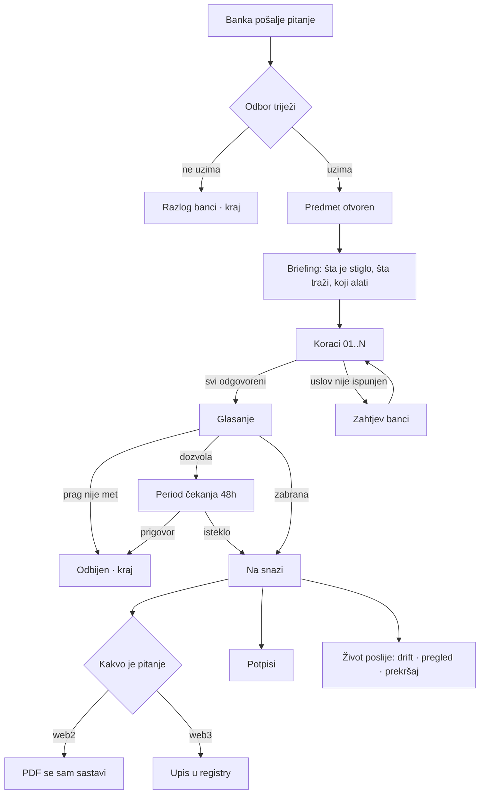
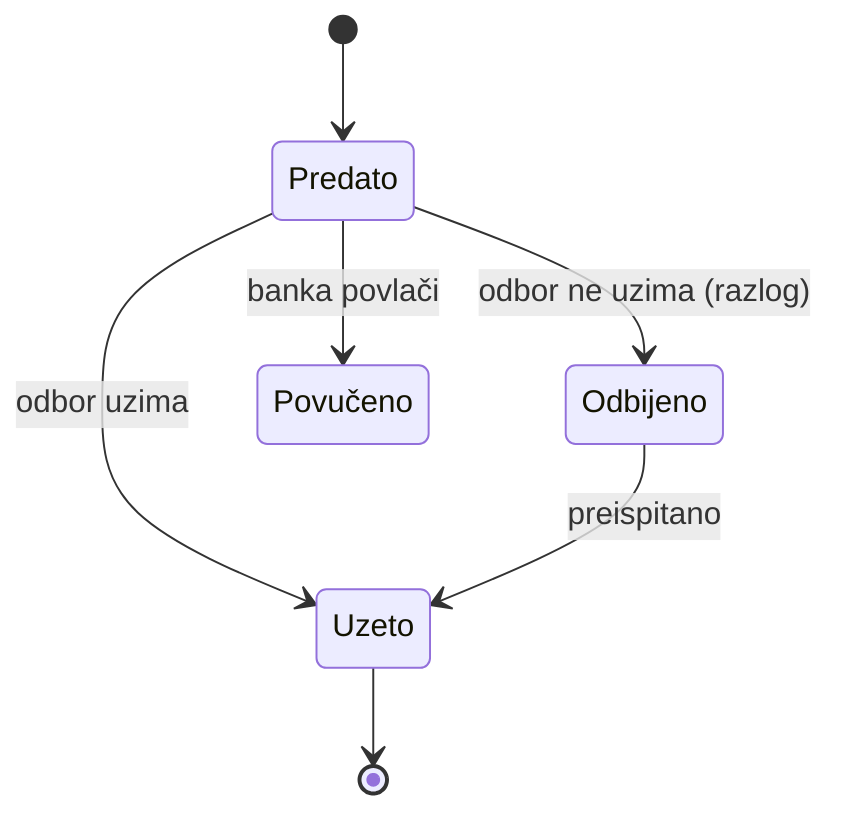
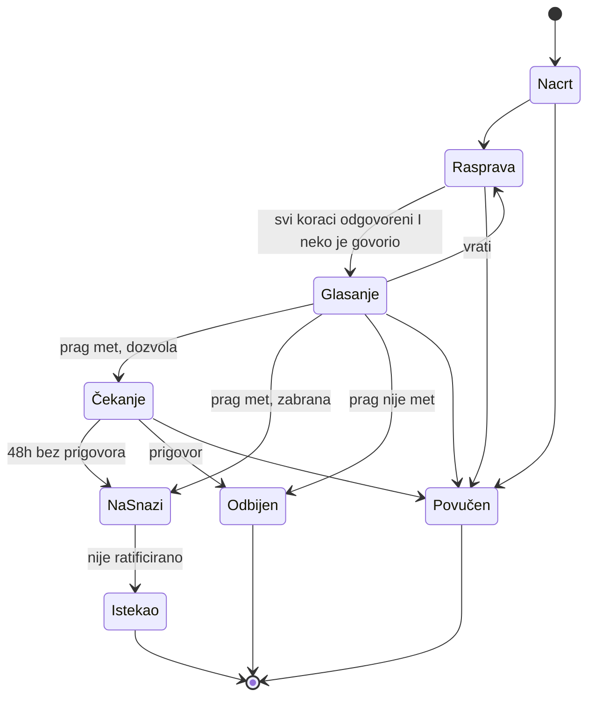
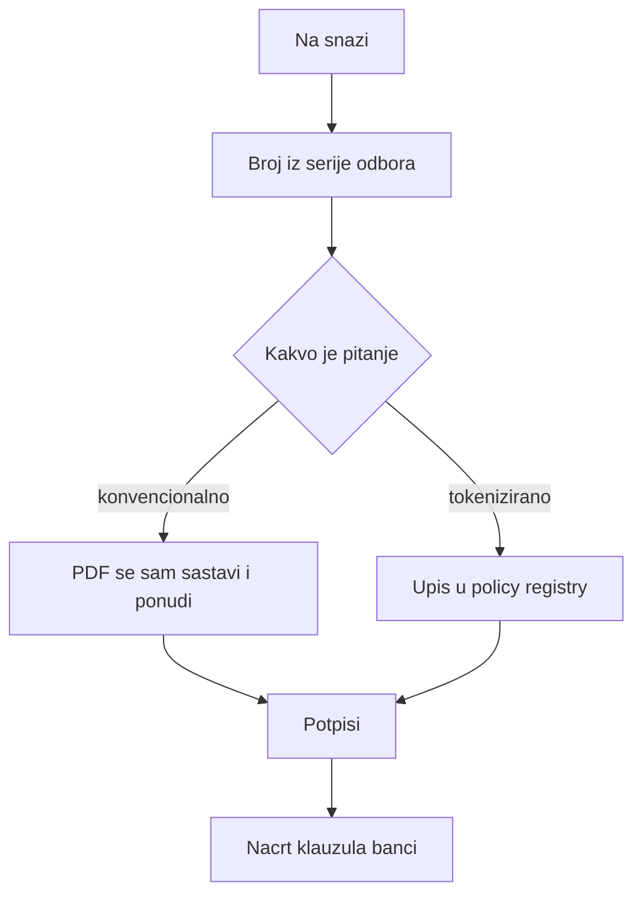
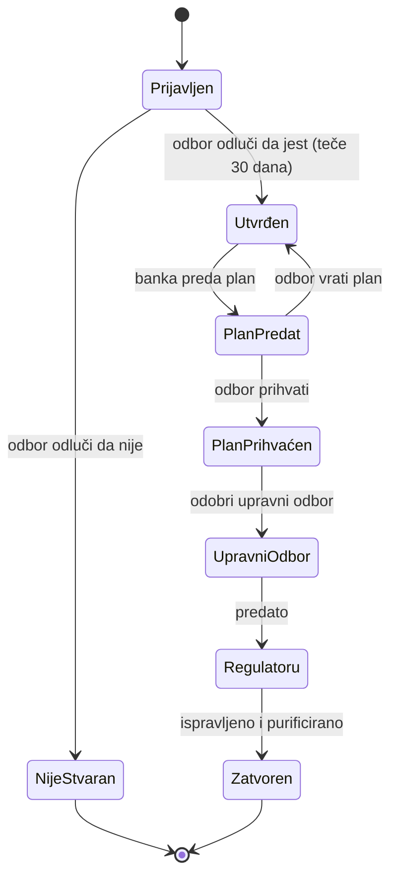
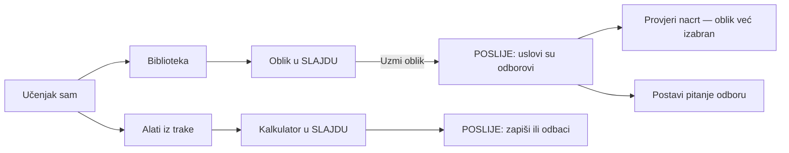

# Algoritam Majlisa

Ovo je specifikacija toka, ne popis gumbi. Svaki čvor ima **ime, ekran,
uslove, činove, i gdje svaki čin vodi**. Uz svaki čvor piše i **kako izgleda
kroz aplikaciju** — koji prozor, koja okna, koja traka, koji alat.

Sve granice su čitane iz koda: prelazi iz `services/lifecycle.ts`, uloge iz
`lib/identity.ts`, faze prekršaja i vrste računa iz `server/src/types.ts`.

---

## 0 · Kako se ovo čita

**Čvor** `N-xx` je jedno stanje aplikacije: tačno jedan prozor na ekranu.

Svaki čvor ima:

```
N-xx  IME
      PROZOR     koji okvir, koja okna, šta je u traci
      ULAZ       odakle se dolazi
      ALAT       šta aplikacija sama otvori tu
      ČIN        [gumb]  uslov  →  odredište
      IZLAZ      gdje se završava
```

**Tipovi prozora** — samo četiri, i svaki čvor koristi jedan:

| tip | kad | anatomija |
|---|---|---|
| **RADNI** | korak u toku | naslovna traka · traka stanica · rad · bočno okno · traka činova |
| **DIJALOG** | čin sa posljedicom | naslov · šta radi i kome · polje razloga · otkaži / uradi |
| **SLAJD** | izbor ili alat | naslov · sadržaj koji se skroluje · traka činova |
| **POSLIJE** | ishod čina | šta je urađeno · šta to znači · **šta slijedi** (≤3) |

Nijedan čvor nije „stranica sa klikanjem". Ako neki jeste, to je greška u
ovom dokumentu ili u kodu.

---

## 1 · Cijeli sistem



---

## 2 · Tok 1 — pitanje stiže



### N-10 · BANKA POSTAVLJA PITANJE

```
PROZOR   RADNI — jedna stanica, bez trake
ULAZ     /ask  ·  uloga: banka ili bilo ko od odbora
ALAT     nijedan
ČIN      [Izaberi fajl]     uvijek              →  ostaje, fajl priložen
         [Postavi odboru]   naslov i pitanje popunjeni  →  N-11
                            inače: gumb mrtav
IZLAZ    POSLIJE: „predato, čeka odbor" → moja pitanja · šta me obavezuje
```

### N-11 · U REDU KOD ODBORA

```
PROZOR   RADNI — red, najstarije prvo
ULAZ     /  ili  /questions
ALAT     prepoznavanje oblika iz priloženog ugovora — automatski
ČIN      [Uzmi kao predmet]  uloga raspravlja  →  DIJALOG: naslov, prijedlog,
                              smjer (dozvola/zabrana)  →  N-20
         [Ne uzimaj]         uloga raspravlja  →  DIJALOG: razlog obavezan
                                                  →  POSLIJE: banka vidi razlog
         [Više o ovom]       uvijek            →  sklopljeno: pozadina, ugovor
         posmatrač/banka     —                 →  činova nema
IZLAZ    N-20 ili kraj
```

**NEMA:** notifikacija čim pitanje stigne.

---

## 3 · Tok 2 — predmet, stanje po stanje



### N-20 · BRIEFING — stanica `i`

```
PROZOR   RADNI · traka:  [i] 01 02 .. N [V]
         rad: šta su poslali · šta traže · po čemu se sudi · KOJI ALATI
         okno: pitanje, šta se ne odlučuje, oblik
ULAZ     N-11, ili povratak na stanicu i
ALAT     nijedan još — ovdje se samo **najavljuju** oni koje oblik traži
         (iz structure.calculations, ne iz teksta uslova)
ČIN      [Pročitao sam — kreni]  →  N-30 prvog koraka bez odgovora
                                    ako ih nema  →  N-40
IZLAZ    N-30
```

**KLJUČ:** sažetak „traže ovo i ovo" iz PDF-a traži model.

### N-30 · KORAK — jedan uslov

```
PROZOR   RADNI · traka stanica, tekuća označena
         rad: zahtjev · zašto postoji · ALAT · šta su drugi našli · razlog
         okno: pitanje (stoji cijelim putem)
         traka: [Ne primjenjuje se] [Nije ispunjen] [Ispunjen — dalje]
ULAZ     N-20, ili prethodni korak, ili klik na stanicu u traci
ALAT     ako uslov traži brojku → kalkulator koji OBLIK imenuje, otvoren
         u koraku, popunjen iz dokumenta (KLJUČ), vezan za ovaj uslov
         ako uslov traži dokument → čitač dokumenta, sa stranicom i citatom
ČIN      [Ispunjen — dalje]   razlog upisan    →  zapis  →  sljedeći bez
                                                  odgovora, inače N-40
                              razlog prazan    →  mrtav, traka kaže zašto
         [Nije ispunjen]      razlog upisan    →  DIJALOG (šta to znači:
                                                  klauzula banci sa linijom
                                                  da ugovor mora predvidjeti)
                                                  →  zapis  →  N-31
         [Ne primjenjuje se]  razlog upisan    →  DIJALOG (ne pravi klauzulu)
                                                  →  zapis  →  sljedeći
         [Pitaj banku]        nije već pitano  →  DIJALOG sa uslovom u sebi
                                                  →  N-32
         uloga ne raspravlja  —                →  činova nema
IZLAZ    sljedeći korak · N-31 · N-32 · N-40
```

### N-31 · POSLIJE „NIJE ISPUNJEN"

```
PROZOR   POSLIJE, u radnom prozoru
         „zapisano kao neispunjeno · ide na odluku I u klauzule banci"
ČIN      [Postavi banci zahtjev]  →  N-32
         [Sljedeći korak]         →  N-30
         [Ništa više]             →  ostaje
```

### N-32 · ZAHTJEV BANCI

```
PROZOR   DIJALOG → POSLIJE
ALAT     nacrt se otvara sa tekstom uslova već u sebi
ČIN      [Pošalji]  tekst upisan  →  na ekran banke /i-owe
                                     sat predmeta se ODVAJA (ne skriva)
IZLAZ    POSLIJE: „banka ima pitanje, sat se odvaja" → nazad na korak
```

### N-40 · GLASANJE — stanica `V`

```
PROZOR   RADNI · rad: prag, ko je kako glasao, ko nije
ULAZ     zadnji korak, ili klik na V
ALAT     nijedan
ČIN      [Otvori glasanje]   koraci odgovoreni I neko govorio, potpisnik
                             →  DIJALOG: prag N, ko mora potpisati  →  glasanje
                             koraci nisu  →  GUMBA NEMA, piše koliko fali
                             niko nije govorio  →  ??? NEDEFINISANO
         [Zapiši glas]       potpisnik, nije glasao  →  DIJALOG: za/protiv/
                             suzdržan + razlog  →  koliko još fali
                             već glasao  →  ??? NEDEFINISANO
         [Zatvori glasanje]  potpisnik  →  DIJALOG: prag met/nije, šta slijedi
                             u oba slučaja  →  N-50 · N-41 · odbijen
         [Prigovori]         čekanje, potpisnik  →  DIJALOG: pisani razlog
                             →  zaustavljeno
         savjetodavni/vezni  →  činova nema, može u raspravi
IZLAZ    N-41 · N-50 · kraj
```

### N-41 · PERIOD ČEKANJA (samo dozvola)

```
PROZOR   RADNI · rad: koliko je ostalo, ko može zaustaviti
ČIN      [Prigovori]  potpisnik  →  DIJALOG  →  odbijen
         sat istekne             →  N-50 automatski
IZLAZ    N-50 ili kraj
```

---

## 4 · Tok 3 — odluka izlazi



### N-50 · ODLUKA NA SNAZI

```
PROZOR   RADNI, bez trake stanica
         rad: pisana odluka, potpisi, broj SSB/godina/n
ALAT     nijedan
AUTOMATSKI  broj iz serije            IMA
            PDF sam iskoči            NEMA
            upis u registry (web3)    NEMA — ugovor onlyOwner
            PDF banci                 BANKA
ČIN      [Potpiši uređajem]   ima upisan uređaj  →  DIJALOG: šta potpis
                              dokazuje a šta ne  →  POSLIJE
                              nema uređaja       →  potpis prijavom
         [Reci banci]         →  DIJALOG  →  BANKA
IZLAZ    kraj toka predmeta
```

---

## 5 · Tok 4 — prekršaj, osam faza



| čvor | čin | ko | grana |
|---|---|---|---|
| Prijavljen | Prijavi | **danas samo odbor** | odluka čeka |
| | Slažem se / **Ne slažem se** | potpisnik, razlog obavezan **u oba smjera** | Utvrđen · **NijeStvaran — nema na ekranu** |
| Utvrđen | Zaustavljeno · Na upravni | sekretar/vezni | datum u zapis |
| PlanPredat | Prihvati · **Vrati sa razlogom** | odbor | naprijed · nazad |
| | Purifikacija | odbor | iznos i kome |
| | Plaćeno | **danas samo odbor, banka ne može** | odluka čeka |
| Zatvoren | Zatvori | odbor | u godišnji izvještaj |

---

## 6 · Tok 5 — bez pitanja iz banke



### N-60 · ALATI

```
PROZOR   SLAJD · sedam kartica
ULAZ     [Alati] u gornjoj traci — sa BILO KOJEG ekrana
ALAT     screening · purifikacija · zekat · raspodjela · tangibilnost ·
         zatezna · zapisani računi
ČIN      [Izračunaj]     →  rezultat i da li prelazi prag
         [Zapiši]        →  POSLIJE: „zapisano, nije vezano ni za koji predmet"
IZLAZ    zatvori — vraća tačno gdje si bio
```

**Razlika koja se mora razumjeti:** u koraku alat bira **aplikacija** (iz
oblika) i rezultat se **veže za uslov**. Iz trake bira **član** i rezultat se
**ne veže ni za šta** dok ga ne zapiše.

---

## 7 · Ko šta smije — matrica

| čin | potpisnik | savjetodavni | vezni | sekretar | banka | posmatrač |
|---|---|---|---|---|---|---|
| raspravlja, zapisuje nalaz | ✓ | ✓ | ✓ | ✓ | — | — |
| glasa, zatvara, prigovara | ✓ | — | — | — | — | — |
| potpisuje odluku | ✓ | — | — | — | — | — |
| unosi šta je banka uradila | — | — | ✓ | ✓ | — | — |
| zapisnik sjednice | — | — | — | ✓ *(i predsjedavajući)* | — | — |
| kvorum, serija brojeva | — | — | — | ✓ *(i predsjedavajući)* | — | — |
| predaje pitanje | ✓ | ✓ | ✓ | ✓ | ✓ | — |
| troja vrata banke | — | — | — | — | ✓ | — |

---

## 8 · Stanja koja nisu činovi

| situacija | šta prozor radi |
|---|---|
| server ćuti | *ne zna se* ≠ *ništa ne čeka* |
| prazno | rečenica šta to znači |
| bez asistenta | paneli **odsutni**, ne sivi; briefing kaže da brojke neće doći popunjene |
| bez lanca | tokenizirano **ne postoji** kao pojam |
| bez volumena | prilaganje odsutno |
| timelock istekne | **NEMA — nije rečeno šta se desi** |
| stara adresa | **NEMA preusmjerenja** |

---

## 9 · Otvoreno — traži odluku, ne kod

| | |
|---|---|
| **Izuzeće člana** | nema rute nigdje |
| **Ratifikacija zabrane** | prozor u tipu, čina nema → zabrana nikad ne istekne |
| **Ko prijavljuje prekršaj i plaća purifikaciju** | danas samo odbor |
| **Nalaz dok je glasanje otvoreno** | nije zabranjeno u kodu |
| **Promjena glasa** | nedefinisano |
| **Glasanje bez rasprave** | server odbija, ekran ne kaže unaprijed |

---

## 10 · Šta ostaje da se napravi

1. Prozor + „šta slijedi" na svih 76 činova — danas ~8
2. Šest odluka iz §9
3. Automatizam §4 — PDF i registry
4. Notifikacija, timelock kad istekne, stare adrese
5. KLJUČ — sažetak i brojke iz PDF-a
6. BANKA — slanje

---

---

# 11 · Kako se ovo ponaša kao aplikacija

Do ovdje je pisalo **šta** se dešava. Ovaj dio piše **kako** — i to je razlika
između aplikacije i stranice na koju se klika. Stranica se učita, pročita i
napusti. Aplikacija je **sesija rada**: pamti gdje si, ne gubi ono što si
otkucao, odgovara na tastaturu, i nikad te ne baci na početak.

Svako pravilo ispod je obavezno na svakom čvoru. Ako neki čvor to ne radi, to
je greška, a ne stvar ukusa.

## 11.1 · Nikad se ne gubi mjesto

| pravilo | zašto |
|---|---|
| Zatvaranje slajda ili dijaloga vraća **tačno** gdje si bio — ista pozicija skrola, isto otvoreno okno | Ako te vrati na vrh liste od 19 ugovora, to je stranica |
| Čin koji uspije **ne prebacuje** te na drugi ekran sam od sebe | Prebacivanje odlučuje umjesto tebe; „šta slijedi" ti daje izbor |
| Povratak na predmet otvara **stanicu na kojoj si stao**, ne prvi korak | Predmet od šest koraka se radi u više sjedanja |
| Osvježavanje stranice (F5) vraća isti čvor | Adresa nosi stanje: `/matters/x?step=03` |
| Naprijed/nazad u browseru rade kroz stanice | Stanica je stanje, ne stranica |

**NEMA danas:** stanica nije u adresi; F5 vraća na prvi neodgovoreni korak.

## 11.2 · Otkucano se ne gubi

| pravilo |
|---|
| Razlog otkucan u koraku **preživi** otvaranje kalkulatora, bočnog okna, i prelazak na drugu stanicu i nazad |
| Zatvaranje dijaloga sa otkucanim tekstom **pita** prije nego ga baci |
| Odbijanje sa servera **ne prazni** polja — ni jedno |
| Nacrt pitanja banci se čuva kao nacrt dok se ne pošalje |

**NEMA danas:** prelazak na drugu stanicu briše otkucani razlog.

## 11.3 · Tastatura

| tipka | gdje | šta radi |
|---|---|---|
| `Esc` | dijalog, slajd | zatvara — **radi** |
| `Tab` | svuda | kroz kontrole redom kako se čitaju |
| `Enter` | polje jednog reda | glavni čin tog prozora |
| `Ctrl+Enter` | polje više redova | glavni čin — jer `Enter` tu pravi novi red |
| `←` `→` | traka stanica | prethodna / sljedeća stanica |
| `?` | svuda | šta tipke rade ovdje |
| `/` | svuda | pretraga |

**NEMA danas:** sve osim `Esc`.

## 11.4 · Čekanje

| pravilo | zašto |
|---|---|
| Ekran koji je već tu **ostaje** dok se osvježava | Prazan ekran sa vrtuljkom je korak unazad |
| Sporo se javlja **na mjestu gdje je** — u traci činova, ne preko cijelog ekrana | Cijeli ekran blokiran zbog jednog polja je stranica |
| Gumb koji radi piše da radi i **ne može se pritisnuti dvaput** | Dva ista nalaza iz dva klika su greška u zapisu |
| Ako traje duže od dvije sekunde, kaže **šta** čeka | „Učitavanje" ne govori ništa |

**IMA:** ekran ostaje (`useStillThere`). **NEMA:** ostalo.

## 11.5 · Greške

| pravilo |
|---|
| Greška se pojavi **uz kontrolu** koja ju je izazvala, ne na vrhu ekrana |
| Tekst kaže **šta uraditi**, ne šifru |
| Ekran ostaje upotrebljiv — ostali činovi rade |
| Server koji ćuti ≠ *nema ničega*. To su dvije različite rečenice |
| Greška koja se ponovi tri puta nudi **šta dalje** (osvježi, javi vezni) |

**IMA:** prve četiri. **NEMA:** zadnja.

## 11.6 · Prozori se slažu, ne zamjenjuju

```
RADNI prozor
  └── SLAJD (alat, ugovor)        ← radni ostaje iza, vidljiv
        └── DIJALOG (čin)          ← slajd ostaje iza
```

| pravilo |
|---|
| `Esc` zatvara **samo najgornji** |
| Ono ispod **ostaje živo** i vidi se |
| Nikad tri nivoa — ako treba, čvor je pogrešno zamišljen |
| Fokus ulazi u novi prozor i **vraća se** na gumb koji ga je otvorio |

**IMA:** fokus i Esc. **NEMA:** pravilo o tri nivoa nije nigdje provjereno.

## 11.7 · Brojevi koji žive

| gdje | šta |
|---|---|
| Traka: `Šta te treba` | broj se mijenja čim se nešto riješi, bez osvježavanja |
| Traka stanica | stanica postane zelena čim se nalaz zapiše |
| Glasanje | `2 od 3` se mijenja čim neko glasa |
| Statusna traka | šta instalacija ima — uvijek tačno |

**NEMA danas:** sve se mijenja tek na sljedeće učitavanje.

## 11.8 · Ništa se ne briše

| čin | šta se stvarno desi |
|---|---|
| „Povuci" bilo šta | ostaje u zapisu, označeno povučenim, sa razlogom i imenom |
| Ispravka nalaza | novi nalaz **zamjenjuje** stari; stari se vidi u historiji |
| Jedini pravi brisač | **uređaj za potpis** — to je ključ, ne zapis. Potpisi ostaju |

**IMA.** Ovo je već tako i mora ostati.

## 11.9 · Aplikacija predlaže, čovjek odlučuje

| aplikacija smije | aplikacija ne smije |
|---|---|
| otvoriti alat koji oblik imenuje | izabrati alat iz teksta uslova |
| popuniti brojku iz dokumenta, sa citatom | upisati je u račun bez potvrde |
| ponuditi raniji nalaz odbora o istom uslovu | zapisati ga kao tvoj |
| reći da prag nije met | zaključiti da je nešto dozvoljeno |
| složiti PDF čim odluka stupi na snagu | poslati ga bez čovjeka |

**Ovo je granica cijelog proizvoda.** Sve iznad je automatizam koji skida
posao; sve ispod je softver koji presuđuje umjesto odbora.

## 11.10 · Šta se vidi bez ijednog klika

Na svakom čvoru, bez otvaranja ičega:

1. **gdje si** — naslov i traka stanica
2. **šta se traži od tebe sada** — jedna rečenica
3. **šta možeš uraditi** — traka činova, uvijek na istom mjestu
4. **šta je stanje** — čipovi, brojevi, statusna traka

Ako nešto od ova četiri traži klik, čvor je pogrešno složen.

---

# 12 · Čvorovi koji još nisu razrađeni

Iskreno: gore je razrađeno oko 15 čvorova. Ovo su ostali, i svaki traži isti
tretman — prozor, ulaz, alat, činovi sa uslovima, izlaz:

| područje | čvorovi |
|---|---|
| **Registar** | lista · holding · unos · povlačenje · oznaka konvencionalno/tokenizirano · drift na holdingu · spajanje instrumenata *(nema rute)* |
| **Pregledi** | lista · zapisivanje pregleda · uzorak · nalaz po uslovu · pokrivenost nepoznata |
| **Sjednice** | saziv · dnevni red · prisustvo · zapisnik · zatvaranje · knjiga sjednice |
| **Obaveze** | zapis · dospijeće · zatvaranje · ko duguje |
| **Komiteti** | osnivanje · upućivanje · izvještaj · povlačenje · raspuštanje |
| **Biblioteka** | 19 oblika · uzimanje · preispitivanje · odbijanje · izmjena uslova |
| **Provjera nacrta** | unos teksta · izbor oblika · čitanje · nalaz po uslovu · otvaranje predmeta |
| **Papiri** | odluka · klauzule · priručnik · godišnji · holding · izvoz · kalendar |
| **Nalog** | ime i titula · lozinka · uređaji · povratak pristupa |
| **Odbor** | članovi · kvorum · prozor potvrde · serija brojeva · historija izmjena |
| **Pretraga** | upit · rezultati po vrsti · otvaranje |
| **Banka** | tri ekrana · odgovor odboru · plaćanje *(nema)* · prijava *(nema)* |

**Redoslijed razrade:** registar → provjera nacrta → sjednice → pregledi →
ostalo. Prvo ono što se dodiruje sa predmetom.

---

*Gradi se tek kad ovo bude potvrđeno.*
