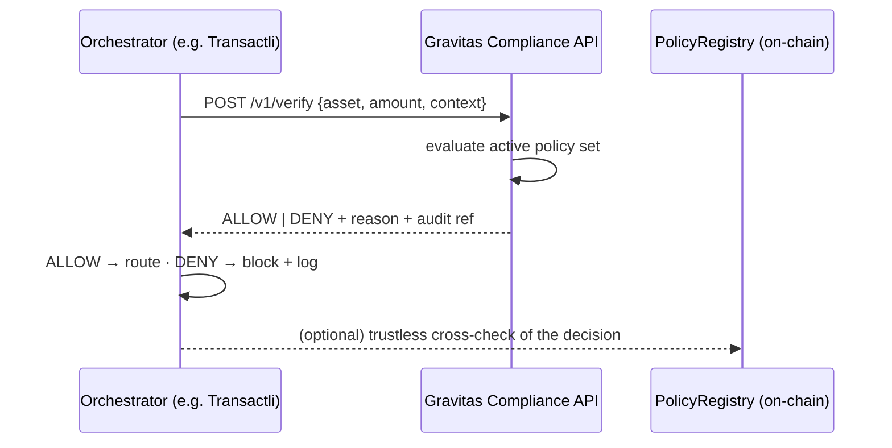

# Gravitas Integration Kit

**Pre-execution Shariah-compliance verification for payment orchestration.**
Everything an integrating engineering team needs to evaluate the Gravitas
Compliance API — spec, runnable mock sandbox, client examples, and the full
PoC scope — with no meetings and no external dependencies.

> Status: **sandbox / testnet**. On-chain source of truth is source-verified on
> Arbitrum Sepolia. Production integrations follow the independent tier-1
> security audit (CertiK / Trail of Bits) — nothing ships to mainnet before it.

## The flow



One synchronous call before routing. Default posture is **DENY** — anything not
explicitly approved by the active policy set is blocked.

## 10-minute quickstart

```bash
# Terminal 1 — mock sandbox (implements the OpenAPI contract)
cd mock-server && npm install && npm start        # → http://localhost:8787

# Terminal 2 — run the six Annex-A PoC scenarios (3 ALLOW / 3 DENY)
cd sdk-examples && npm install && npm run verify  # expect: 6/6 passed

# Optional — trustless on-chain read of the live registry (testnet)
# (Works out-of-the-box via Sourcify; set ARBISCAN_API_KEY to use Etherscan)
cd sdk-examples && npm run onchain
```

Every verification is appended to `mock-server/audit.log.jsonl` — the audit
trail format referenced in Annex A.

## Repository map

| Path | What it is |
|------|-----------|
| `openapi/gravitas-compliance-api.yaml` | The integration contract — request/response schemas, examples, error semantics |
| `mock-server/` | Local implementation of the contract; decisions driven by the sandbox policy set |
| `policies/sandbox-policies.json` | Example policy set: approved assets, prohibited categories (riba / gharar / maysir), inactive-policy case |
| `sdk-examples/verify-client.ts` | Runs all six PoC scenarios, prints pass/fail |
| `sdk-examples/onchain-read.ts` | Fetches the **verified ABI from the explorer** and reads the live registry — no trust in any Gravitas server required |
| `scenarios/poc-test-scenarios.md` | Annex A scenarios + measurable success criteria |

## Verify the chain, not the claims

| Contract | Network | Address |
|----------|---------|---------|
| GravitasPolicyRegistry | Arbitrum Sepolia | `0xbcaE3069362B0f0b80f44139052f159456C84679` |
| TeleportV3 (atomic execution engine) | Arbitrum Sepolia | `0x5D423f8d01539B92D3f3953b91682D9884D1E993` |

Both are source-verified. `onchain-read.ts` deliberately pulls the ABI from the
explorer at runtime — the same path any independent reviewer would take.

## Scope and process

- The full PoC scope, in/out-of-scope list and success criteria live in the
  partnership proposal, **Annex A**, and in `scenarios/`.
- Technical questions: **in writing** (email / issues) — answers within 24–48 h
  with references to code and documentation.
- Hosted sandbox keys and internal integration documentation are shared under
  **Phase 0 (NDA)** of the partnership. The protocol repository itself is public
  and source-verified — verify the chain, not the claims.

---

**Gravitas Protocol** — compliance enforced by code.
Contact: abdusamed@gravitasprotocol.xyz · www.gravitasprotocol.xyz
